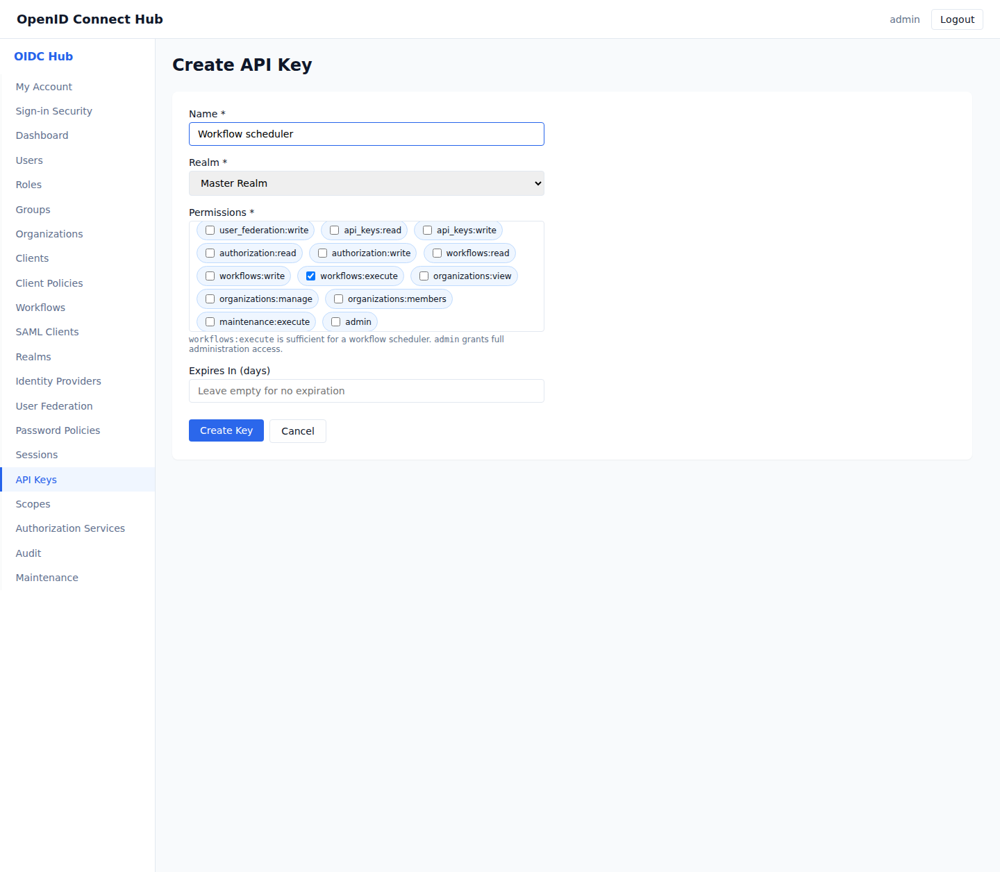

# Create API keys for administration automation

[Documentation home](README.md) · [Delegated permissions](delegated-administration.md) · [Service accounts and agents](service-accounts-and-agents.md)

API keys authenticate scripts and schedulers to the hub administration API. They are realm-scoped and carry explicit permissions. They are different from OIDC client secrets, which applications use at protocol token endpoints.



## Create a key

1. Sign in with an administrator allowed to manage API keys.
2. Open **API Keys** and choose **Create Key**.
3. Select the realm the automation will manage.
4. Enter a name that identifies the workload and environment.
5. Select only the required permissions. For example, a workflow scheduler needs `workflows:execute`.
6. Set an expiration period and create the key.
7. Copy the complete key immediately into the workload's secret store. The console cannot show it again.

Use `admin` only when the automation truly needs every administration action. The [delegated administration permission reference](delegated-administration.md#permission-reference) lists narrower permissions.

## Call the API

Send the raw key in `X-API-Key`:

```sh
curl --fail-with-body \
  --header "X-API-Key: $HUB_ADMIN_API_KEY" \
  "https://identity.example.com/api/users?realm_id=$REALM_ID"
```

The key can access only records in its own realm. A route also rejects the request when the key lacks the exact action permission.

## Store and rotate keys

- Store the key in a secret manager or protected platform secret, never in source control or browser code.
- Give different jobs different keys so one can be revoked without interrupting the others.
- Review **API Keys** for last use, use count, expiry, and revoked state.
- Choose **Rotate** before expiry. The previous key remains valid for a 24-hour grace period, giving you time to update the workload secret and verify the replacement.
- Choose **Revoke** when a workload is retired or a key may have been exposed.

Rotation displays the replacement value once. If a key is lost, rotate it; it cannot be recovered. Finish the workload cutover within the 24-hour grace period.

## Troubleshooting

- **Unauthorized:** confirm the complete raw value was copied and that the key is active and unexpired.
- **Forbidden:** add the missing permission or use a different key; also confirm the requested resource belongs to the key's realm.
- **A scheduler stopped:** verify that its secret reference still points to the current key after rotation.
- **The key is visible in logs:** remove it from logging, rotate it immediately, and review Audit for unexpected activity.
