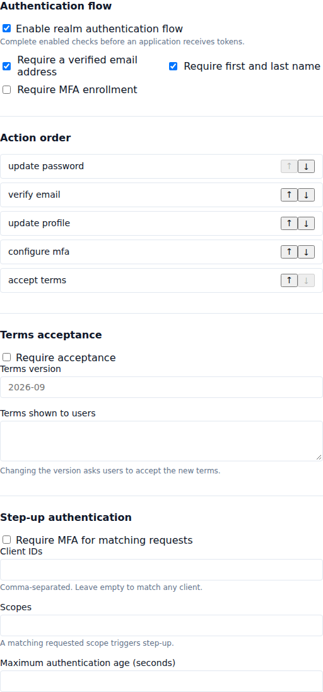
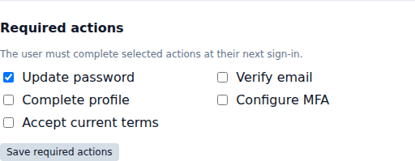
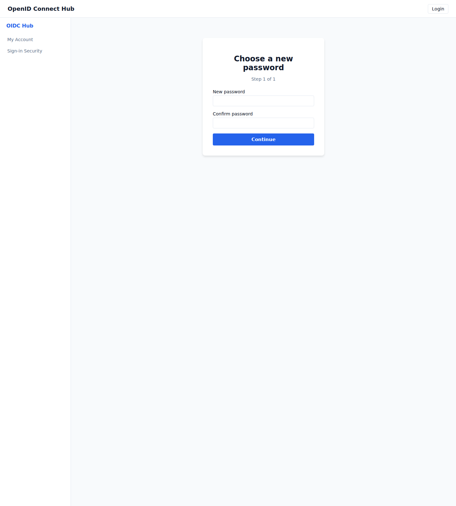

# Configure sign-in actions

[Documentation home](README.md) · [Use cases](README.md#use-cases)

Authentication flows let realm administrators require users to finish account setup before an application receives access. A user sees each action after entering valid sign-in credentials and continues to the application only after every action is complete.

## Configure the realm flow

1. Sign in to the administration console and open **Realms**.
2. Select **Edit** for the realm.
3. Find **Authentication flow** and enable the realm authentication flow.
4. Select the checks that apply to every user in the realm.
5. Arrange the actions in the order users should complete them.
6. Select **Save Changes**.

The available realm checks are:

- **Require a verified email address** sends users through email verification when their address is unverified.
- **Require first and last name** asks users to complete missing profile information.
- **Require MFA enrollment** asks users without an authenticator to configure one and creates recovery codes during setup.
- **Terms acceptance** displays the text entered by the administrator. Enter a new version whenever the terms change; users who accepted an older version will be asked again.

Disabling the realm flow stops realm-wide checks. Actions assigned directly to a user remain active.

## Require an action for one user

1. Open **Users** and select **View** for the user.
2. Find **Required actions**.
3. Select one or more actions.
4. Select **Save required actions**.

Use **Update password** for a temporary or administrator-created password. The user must choose a different password that satisfies the realm password policy. **Verify email**, **Complete profile**, and **Configure MFA** are automatically considered complete when their account already meets the requirement. **Accept current terms** requires an enabled terms policy with a current version.

## What users see

After valid credentials are accepted, the sign-in page shows one action at a time. Applications do not receive tokens while an action remains. The action link expires after ten minutes; the user can sign in again to start a new session.

For email verification, the user opens the link delivered to their email address or pastes the verification token into the sign-in page. For MFA setup, the user adds the displayed secret to an authenticator app and enters the current six-digit code. Recovery codes are generated when setup finishes.

## Require step-up authentication

Enable **Step-up authentication** in the realm flow when sensitive applications or scopes require MFA:

1. Enter client IDs to limit the rule to selected applications. Leave the list empty to match all clients.
2. Enter scopes to trigger the rule only when at least one listed scope is requested. Leave the list empty to match every scope.
3. Optionally set a maximum authentication age. A session older than this value must authenticate again.
4. Save the realm.

A request must match both configured client and scope filters. Requests that explicitly ask for the realm's MFA assurance level also trigger step-up. Silent requests return an interaction-required response when the user must act.

## Troubleshooting

If a user repeatedly returns to the same action, confirm that the change was saved and that their action link has not expired. For terms, verify that a non-empty version and text are configured. If email does not arrive, check the realm email delivery configuration and use **Send verification email** again. An administrator can remove an incorrectly assigned action from the user's details page.
