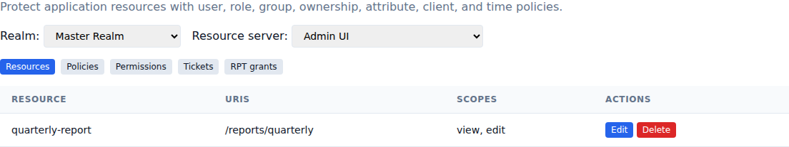
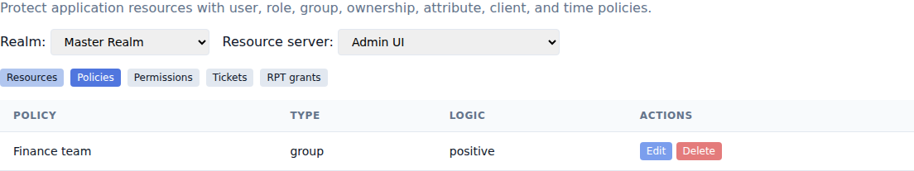
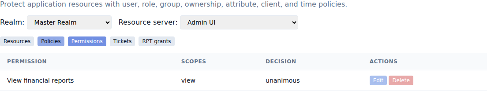

# Protect APIs with Authorization Services

[Documentation home](README.md) · [Use cases](README.md#use-cases)

Authorization Services lets an application define protected resources, decide who may use them, and issue Requesting Party Tokens (RPTs) containing the permissions granted to a user. Use it when a simple application role is too broad, such as allowing members of the finance group to view one report while only its owner may edit it.

## Prepare the resource server

1. Open **Clients** and select the client that represents the protected API.
2. Add **UMA Permission Ticket** to **Allowed grant types** and save the client.
3. Open **Authorization Services**.
4. Select the realm and the resource-server client.

The client must be confidential when it obtains a protection token with client credentials. Keep that credential in the API service; browser and mobile applications should never receive it.

## Register protected resources

On the **Resources** tab, select **Add resource** and enter:

- A unique name and optional display name and type.
- One protected application path per line under **URIs**.
- Space-separated actions under **Scopes**, such as `view edit delete`.
- An optional owner user ID for owner-based rules.
- Optional JSON attributes for rules based on the resource, such as `{"classification":"internal","department":"finance"}`.

Resource attributes are application metadata used during authorization. They are not shown to users and do not add token claims by themselves.

An API can also create, inspect, update, and delete its resources through the resource registration endpoint advertised by the realm's UMA discovery document.

## Create policies

Policies describe a condition. Open **Policies**, select **Add policy**, choose a type, and enter its JSON configuration.

| Type | Configuration example | Grants access when |
|---|---|---|
| User | `{"users":["user-uuid"]}` | The signed-in user is listed. |
| Role | `{"roles":["editor"],"match":"any"}` | The user has one listed effective realm or client role. Use `client-id:role-name` for a client role. Set `match` to `all` to require every role. |
| Group | `{"groups":["finance"]}` | The user belongs to a listed group. |
| Client | `{"clients":["portal"]}` | The requesting client is listed. |
| Owner | `{}` | The signed-in user matches the resource's owner. |
| Attribute | `{"source":"user","key":"department","operator":"equals","value":"finance"}` | A user, token, or resource value matches. Sources are `user`, `token`, and `resource`; operators are `equals`, `not_equals`, `contains`, and `present`. |
| Time | `{"not_before":"2026-01-01T00:00:00Z","not_on_or_after":"2027-01-01T00:00:00Z","weekdays":[1,2,3,4,5]}` | The UTC time is inside the interval and weekday set. Weekdays run from Monday `1` to Sunday `7`. |

Choose **Negative** logic when the policy should match users who do not meet the condition.

## Combine policies into permissions

Open **Permissions** and select **Add permission**. Choose the resources, scopes, policies, and a decision strategy.

- **Affirmative** grants access when any selected policy passes.
- **Unanimous** requires every selected policy to pass.
- **Consensus** requires more passing policies than failing policies.

Leaving resources empty applies the permission to all resources owned by this resource server. Leaving scopes empty applies it to all registered scopes on those resources. A permission always needs at least one policy.

## Request and enforce an RPT

When an API receives a request without sufficient permission:

1. The API obtains a client-credentials access token for its resource-server client.
2. It sends the resource ID, requested scopes, and optional requesting-user ID to the permission endpoint. The returned ticket is single use and expires after five minutes.
3. The application sends the ticket and the user's access token to the realm token endpoint with grant type `urn:ietf:params:oauth:grant-type:uma-ticket` and claim-token format `urn:ietf:params:oauth:token-type:jwt`.
4. After the configured policies pass, the token endpoint returns an RPT valid for 15 minutes. Its `authorization.permissions` claim lists each resource ID, resource name, and granted scope.
5. The application retries the API call with the RPT. The API can read its signed permission claims and can call the permission evaluation endpoint when it also needs the current persisted grant status.

An application can request permissions directly by sending `audience` and `permission=<resource-id>#<space-separated-scopes>` instead of a ticket. It can also send its current RPT in `rpt`; the response contains a replacement RPT with the previous and newly granted permissions, and the previous token becomes inactive.

To request every permission currently available to a user for one resource server, call the entitlement endpoint with the user's access token.

Use `GET /realms/{realm}/.well-known/uma2-configuration` to discover the token, registration, permission, and entitlement endpoints rather than constructing their URLs in an application.

## Review and revoke grants

The **Tickets** tab shows pending, granted, closed, and expired permission tickets. Close a pending ticket when it should no longer be exchanged.

The **RPT grants** tab shows the user, granted permissions, expiry, and status of every RPT. Select **Revoke** to invalidate a grant immediately. A resource server can also check an RPT through token introspection or revoke it through the standard revocation endpoint.

Expired tickets and RPT grants stop working immediately. Maintenance cleanup removes expired records and older closed or revoked records.

## Troubleshooting

- **The UMA grant is rejected:** confirm that **UMA Permission Ticket** is enabled for the client exchanging the ticket.
- **The ticket is invalid or expired:** request a new ticket. Tickets work once and expire after five minutes.
- **Permission denied:** confirm that the resource contains the requested scopes, that the permission selects that resource and those scopes, and that its policies match the current user and requesting client.
- **An upgraded RPT is inactive:** use the replacement token from the upgrade response. The previous RPT is revoked during the upgrade.
- **A resource owner is rejected:** use the ID of a user in the same realm as the resource server.
