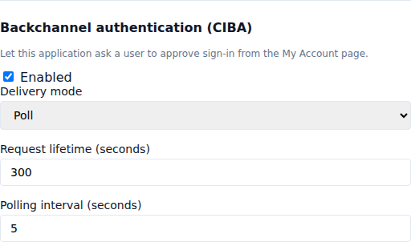
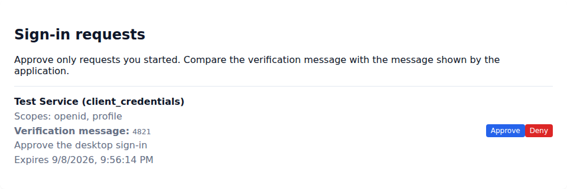

# Approve sign-in on another device

Client-Initiated Backchannel Authentication (CIBA) lets an application start a sign-in for a known user without redirecting the application to a login page. The user reviews the request in **My Account** on a separate signed-in device. This works well for call centers, smart devices, command-line tools, and assisted service desks.

## Enable CIBA for an application

1. Open **Clients** and select the application.
2. Find **Backchannel authentication (CIBA)** and select **Enabled**.
3. Choose **Poll** when the application will check the token endpoint until the user responds.
4. Choose **Ping** when the application has an HTTPS notification endpoint. Enter that endpoint; after the user responds, the hub sends the request ID to it and the application calls the token endpoint.
5. Set the request lifetime and minimum polling interval, then select **Save Changes**.



Enabling CIBA adds `urn:openid:params:grant-type:ciba` to the client’s allowed grant types. Disabling it removes the grant and prevents new requests. Polling intervals can be 2–60 seconds. Requests can remain open for 60–900 seconds.

## Start a sign-in request

The application authenticates at the realm’s backchannel authentication endpoint and identifies the user with `login_hint` or `id_token_hint`. A request must include the `openid` scope.

```http
POST /realms/acme/protocol/openid-connect/ext/ciba/auth
Authorization: Basic base64(client-id:client-secret)
Content-Type: application/x-www-form-urlencoded

login_hint=alex@example.com&scope=openid%20profile&binding_message=4821&request_context=Approve%20the%20desktop%20sign-in
```

The response contains `auth_req_id`, `expires_in`, and `interval`. Store the request ID as a secret. In ping mode, also send a random `client_notification_token` containing at least 128 bits of entropy. The hub uses it as the Bearer token on the notification request.

## Review the request

1. Sign in on the device where you manage your account.
2. Open **My Account**, then **Sign-in requests**.
3. Check the application name, requested access, context, and expiry.
4. Compare the verification message with the message shown by the application.
5. Select **Approve** to finish signing in, or **Deny** if you did not start the request.



Approval records consent for the displayed scopes. If the application requested a stronger authentication level, the user must first sign in with a session that meets that level.

## Retrieve tokens

For poll and ping delivery, authenticate at the normal token endpoint after approval:

```http
POST /realms/acme/protocol/openid-connect/token
Authorization: Basic base64(client-id:client-secret)
Content-Type: application/x-www-form-urlencoded

grant_type=urn:openid:params:grant-type:ciba&auth_req_id=THE_REQUEST_ID
```

The successful response contains an access token, ID token, and refresh token. The ID token includes the CIBA request ID claim so the application can bind the result to the original request. A request can be exchanged only once.

While the user has not responded, the token endpoint returns `authorization_pending`. Polling sooner than the returned interval produces `slow_down` and increases the interval by five seconds. A denial returns `access_denied`; an expired or already exchanged request returns `expired_token`.

If a request is missing from **Sign-in requests**, it may have expired or already been handled. Start a new request. For a ping client that does not receive a notification, it may still poll the token endpoint with the original request ID.
