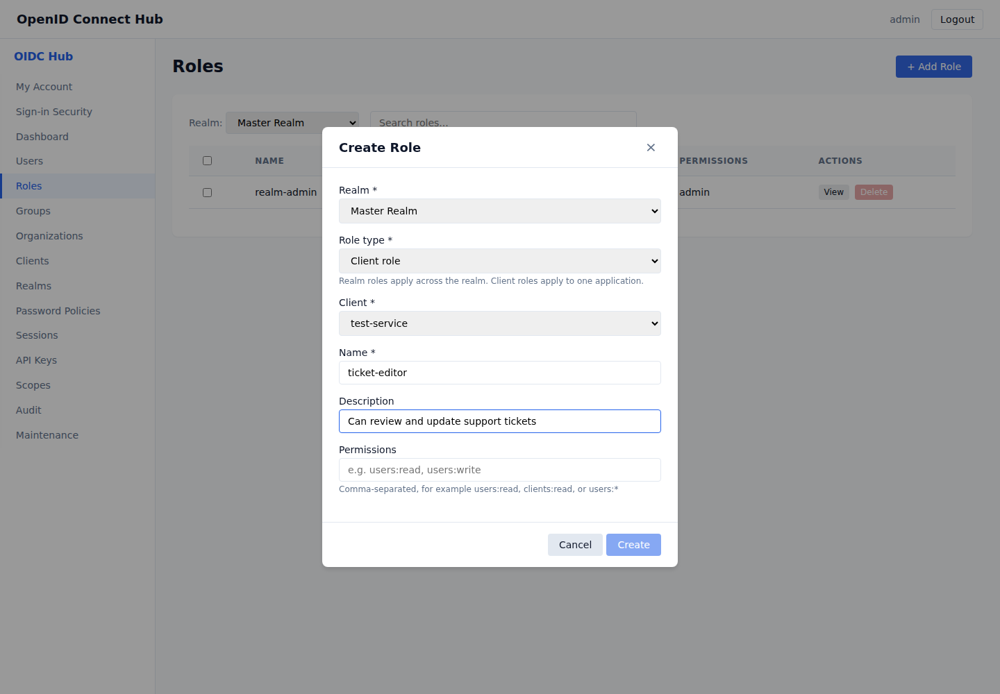
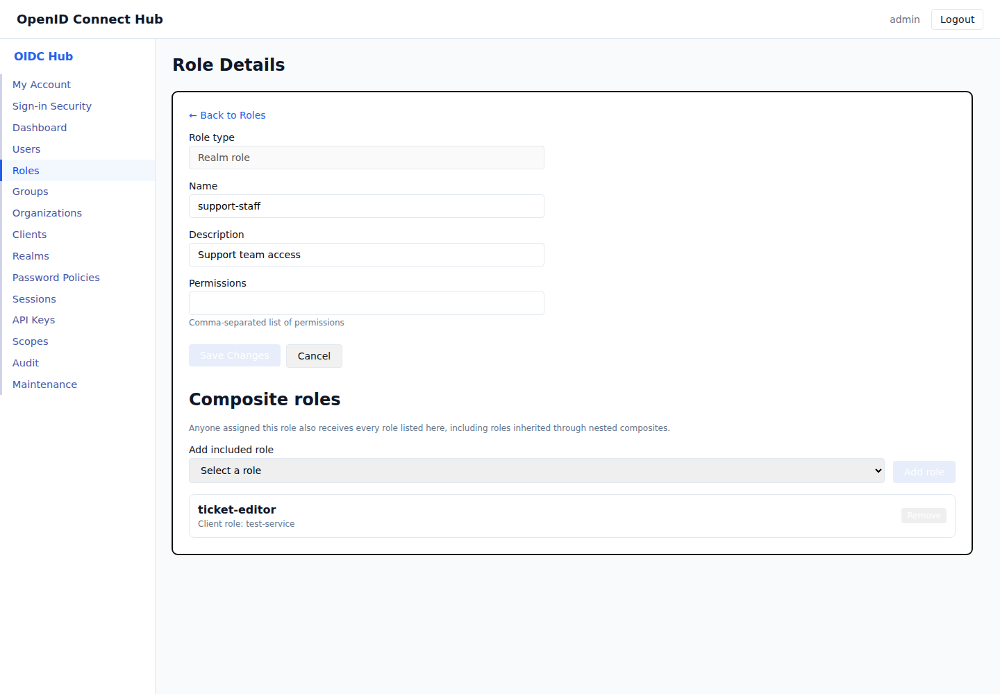

# Client roles and composite roles

[Documentation home](README.md) · [Use cases](README.md#use-cases)

Roles let you give users and groups a named set of access rights. Use a **realm role** when the role applies across the realm. Use a **client role** when the role belongs to one application.



## Create a client role

1. Sign in to the administration console and open **Roles**.
2. Select the realm that contains the application.
3. Select **Add Role**.
4. Choose **Client role**, then select the application.
5. Enter a name, optional description, and any administration permissions that this role should grant.
6. Select **Create**.

The Roles table shows the application in the **Scope** column. Role names must be unique within that application. A realm role and a client role may use the same name because they have different scopes.

## Build a composite role

A composite role includes other roles. Assigning the composite gives the user every included role and every role inherited through further composites.

1. Open **Roles** and select **View** beside the role that will act as the composite.
2. Under **Composite roles**, choose an included role.
3. Select **Add role**.
4. Repeat for each realm role or client role that the composite should include.



The included roles must belong to the same realm. The console rejects a relationship that would make a role contain itself, including indirect cycles. Select **Remove** to stop including a role; this does not delete either role.

## Assign roles

Open a user or group, then add the realm role, client role, or composite role from its **Roles** section. A group assignment applies to every user in that group. Assigning a composite role is usually easier to maintain than assigning all of its included roles separately.

Changes affect new tokens and authorization checks. Existing tokens keep the claims that were present when they were issued.

## Read roles from tokens

ID tokens contain effective roles. Access tokens contain them when the `roles` scope is granted. Realm roles appear in `realm_access`, while client roles are grouped by the application's client ID in `resource_access`:

```json
{
  "realm_access": {
    "roles": ["support-staff"]
  },
  "resource_access": {
    "customer-portal": {
      "roles": ["ticket-editor"]
    }
  }
}
```

The `roles` claim remains available for realm role names. Applications should use `resource_access.<client-id>.roles` when authorizing client-specific actions.

## Resolve common problems

- **The application is missing from the client selector:** confirm that the Roles page and the application use the same realm.
- **The role name is already used:** choose another name or check existing roles for the selected scope.
- **A composite cannot be added:** remove the relationship that would create a cycle, or choose a role from the same realm.
- **A client role is absent from an access token:** request and grant the `roles` scope, then obtain a new token.
- **A user's access did not change immediately:** end the old session or refresh the token so the application receives current effective roles.
