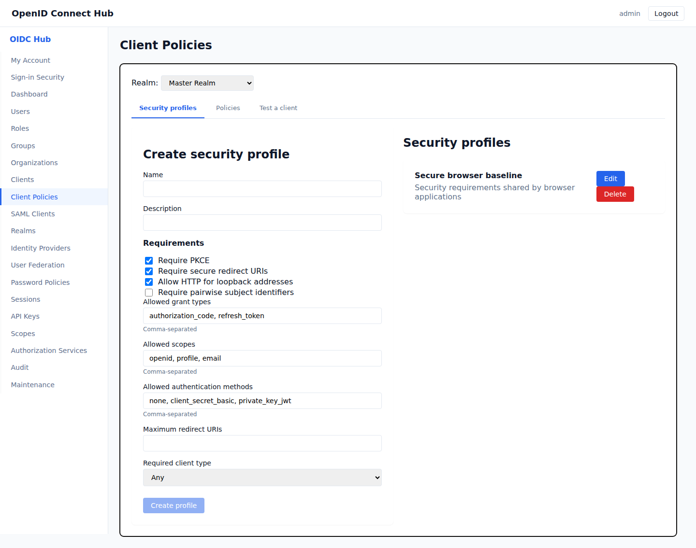
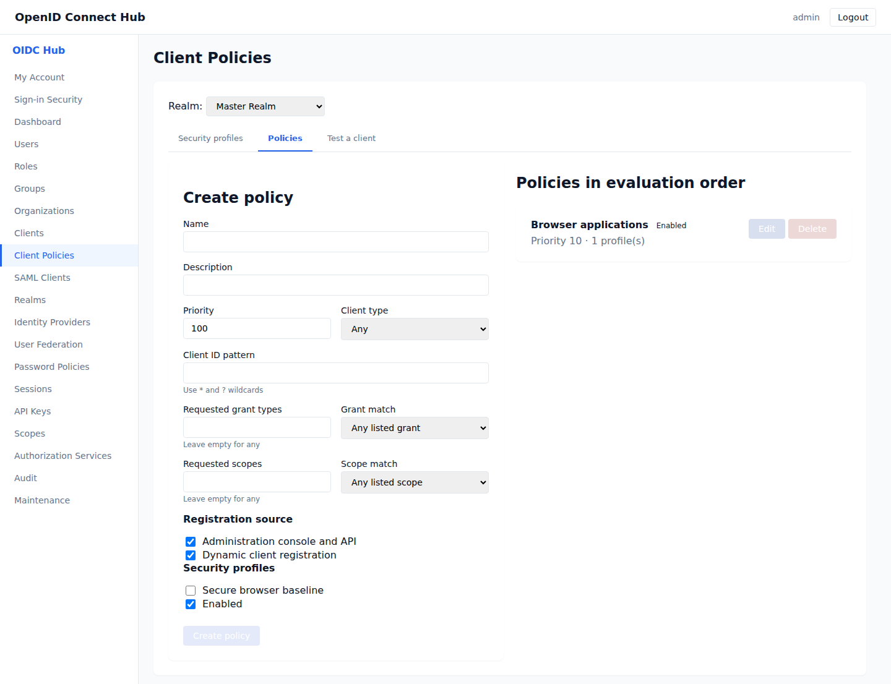
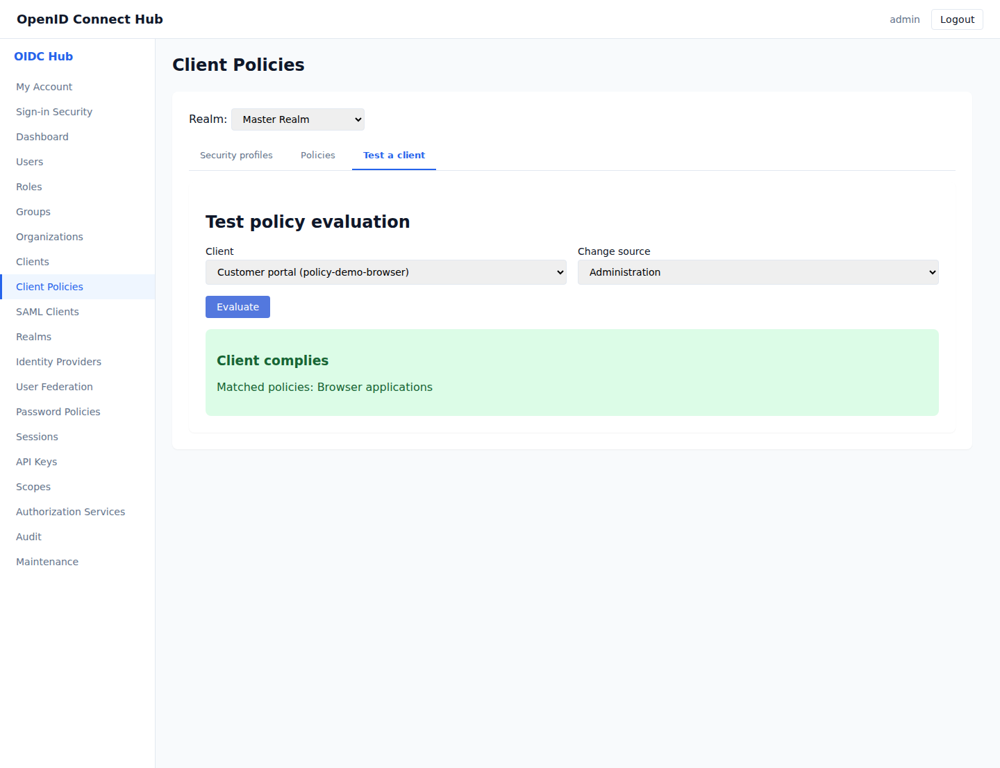

# Enforce client configuration with policies

Client policies let realm administrators apply the same application security rules consistently. A policy selects applications, then applies one or more reusable security profiles whenever an application is registered or changed. Delegated administrators need `clients:read` to view and test policies and `clients:write` to manage them.

Open **Client Policies** in the administration console and select a realm.

## Create a security profile

Open **Security profiles**, enter a name and choose the requirements to enforce. A profile can:

- require PKCE;
- require HTTPS redirect addresses, with an optional exception for local loopback addresses;
- limit grant types, scopes, and client authentication methods;
- require a public or confidential application;
- limit the number of redirect addresses;
- require pairwise subject identifiers.

Choose **Create profile**. Profiles are reusable, so a single baseline can be assigned to several policies.

## Create a policy

Open **Policies**, enter a name, and select at least one security profile. Lower priority numbers are evaluated first.

Use conditions to select the applications covered by the policy:

- **Client type** selects public or confidential applications.
- **Client ID pattern** supports `*` for any sequence and `?` for one character.
- **Requested grant types** and **Requested scopes** select applications by their configuration.
- **Registration source** applies the policy to administration changes, dynamic registration, or both.

Conditions in one policy are combined. An application must match every configured condition before the profiles are applied. A policy with no optional filters applies to every application from the selected registration sources.

Enabled policies are enforced when an administrator creates or edits an application, enables or disables CIBA, assigns a client scope, or when an application uses dynamic client registration. A rejected request includes the policy, profile, and requirement that failed. Correct the application configuration and submit it again.

## Check an existing application

Open **Test a client**, choose an application and the change source, then choose **Evaluate**. The result lists the matched policies and every failed requirement. Testing does not change the application.

## Change or remove a policy

Use **Edit** to change conditions, evaluation order, profiles, or enabled status. Disabled policies remain configured but are skipped during evaluation.

Delete a policy when it is no longer needed. A security profile cannot be deleted while a policy uses it; remove the profile from those policies first. Policy configuration is included when a realm is exported and restored when that realm is imported.
