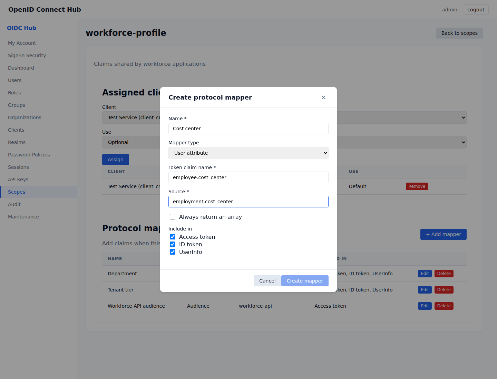

# Client scopes and protocol mappers

Client scopes group reusable token settings. Assign one client scope to several applications when they should receive the same claims, role lists, or API audiences.


## Create and assign a client scope

1. Sign in to the administration console and open **Scopes**.
2. Select the realm, choose **Add Scope**, and enter a clear name such as `workforce-profile`.
3. Select **Manage** beside the new scope.
4. Under **Assigned clients**, choose an application and how the scope is used:
   - **Default** automatically grants the scope whenever that client obtains a new token.
   - **Optional** grants it only when the application requests the scope.
5. Select **Assign**.

An application can only use a client scope from its own realm. Disabling a scope prevents its protocol mappers from adding claims to newly issued tokens.

## Add a protocol mapper

Open the client scope and select **Add mapper**.



Choose the mapper type that matches the value you need:

| Mapper type | Source or value | Result |
|---|---|---|
| User property | A standard property such as `email`, `username`, `given_name`, `family_name`, `locale`, or `phone_number` | Copies the selected user property into the claim. |
| User attribute | An attribute name such as `department`, including nested paths such as `employment.cost_center` | Copies the value from the user's Attributes object. |
| Fixed claim | Text, a number, a boolean, an array, or a JSON object | Adds the same value for every token using the scope. |
| Audience | An API identifier such as `workforce-api` | Adds the identifier to the token's `aud` claim. |
| Realm roles | No source is required | Adds the user's effective realm roles to the chosen claim. |
| Client roles | The application's OAuth client ID | Adds the user's effective roles for that application to the chosen claim. |

The **Token claim name** supports nested names. For example, `employee.department` produces:

```json
{
  "employee": {
    "department": "engineering"
  }
}
```

Select whether the mapper contributes to access tokens, ID tokens, UserInfo, or any combination. **Always return an array** is useful when an application expects a list even when the user currently has one value.

## Request an optional scope

Include the client scope name in the authorization request:

```text
scope=openid profile workforce-profile
```

The granted scope appears in the token response and in the access token's `scope` claim. A default client scope is included automatically. Existing sessions retain their granted scope list; obtain a new authorization grant after changing a default or optional assignment.

## Use role and audience mappings

A realm-role or client-role mapper uses effective roles, including group assignments and composite-role inheritance. This lets an application receive a dedicated claim without having to interpret every role in `realm_access` or `resource_access`.

An audience mapper adds its configured API identifier to `aud`. When a token has more than one audience, `aud` is an array and `azp` identifies the client that requested the token.

## Resolve common problems

- **A claim is absent:** confirm that the scope is assigned to the client, enabled, and either default or included in the requested `scope` value. Also check that the mapper targets the token or UserInfo response you are inspecting.
- **A user attribute is absent:** confirm the user's Attributes object contains the configured source path. Missing values are omitted.
- **A client-role claim is empty:** enter the OAuth client ID shown for the application, then confirm the user receives a role for that application directly, through a group, or through a composite.
- **The claim name is rejected:** security and standard OpenID Connect claim names are protected. Choose an application-specific name such as `employee.department`.
- **A changed mapping is not visible:** obtain a new token. Refreshing a session reevaluates current mapper definitions, while an already issued token cannot change.
