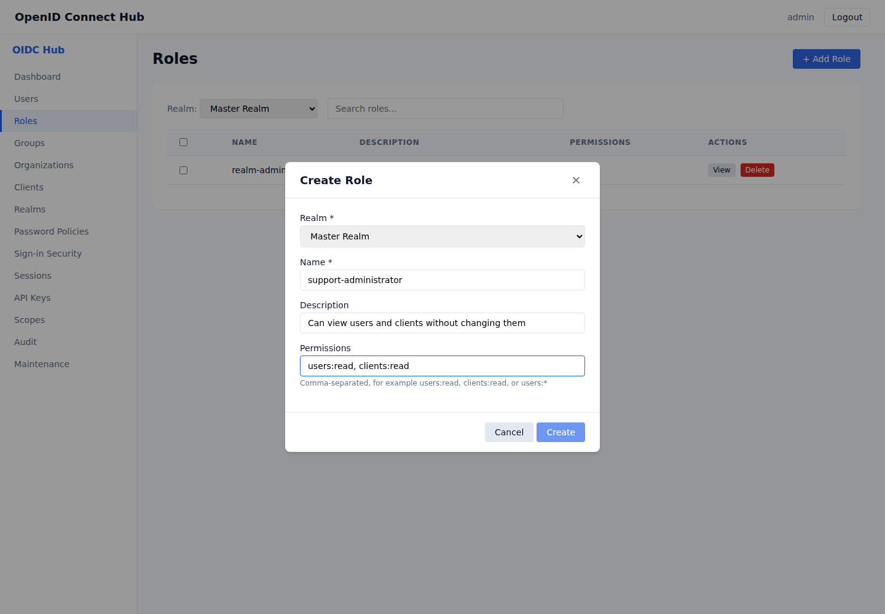

# Delegated administration

[Documentation home](README.md) · [Use cases](README.md#use-cases)

Delegated administration lets a user manage selected parts of a realm without receiving full administrator access. Permissions are collected from roles assigned directly to the user and roles inherited through groups.

## Create a delegated role

1. Sign in with a full administrator account and open **Roles**.
2. Select **Add Role** and choose the realm.
3. Enter a clear role name and description.
4. Enter the required permissions as a comma-separated list.
5. Select **Create**.

Use the smallest set of permissions needed for the administrator's work. Read and change permissions are independent, so a role with `users:read` can view users but cannot create, edit, or delete them.

## Assign the role directly

1. Open **Users** and select the administrator.
2. Open the user's role assignments.
3. Assign the delegated role.

The new permissions apply to the user's next administration request. Removing the role removes its permissions immediately.

## Assign permissions through a group

1. Open **Groups** and create or select a group.
2. Assign the delegated role to the group.
3. Add each administrator to that group.

Users inherit the permissions of every role assigned to their groups. Direct and inherited permissions are combined.

## Permission reference

| Area | View | Change or sensitive action |
|---|---|---|
| Dashboard statistics | `stats:read` | — |
| Users and MFA status | `users:read` | `users:write` |
| User impersonation | — | `users:impersonate` |
| Clients and client registration | `clients:read` | `clients:write` |
| Realms and password policies | `realms:read` | `realms:write` |
| Sessions | `sessions:read` | `sessions:revoke` |
| Audit events | `audit:read` | — |
| Client scopes | `scopes:read` | `scopes:write` |
| Roles and user role assignments | `roles:read` | `roles:write` |
| Groups, membership, and group roles | `groups:read` | `groups:write` |
| Identity providers | `identity_providers:read` | `identity_providers:write` |
| User federation | `user_federation:read` | `user_federation:write` |
| API keys | `api_keys:read` | `api_keys:write` |
| Authorization Services | `authorization:read` | `authorization:write` |
| Workflows and history | `workflows:read` | `workflows:write`, `workflows:execute` |
| Maintenance operations | — | `maintenance:execute` |

`resource:*` grants every action for one area, such as `users:*`. The `admin` permission grants full administration across realms and should be limited to trusted full administrators.

Organizations also support `organizations:view`, `organizations:manage`, and `organizations:members`. These can be restricted to one organization by including its ID, for example `organizations:<organization-id>:members`. See [Organizations](organizations.md#delegate-organization-administration).

## Realm boundaries

A delegated administrator can only access records in their own realm. Listing or opening a record from another realm returns **Forbidden**, even when the role contains the matching action permission. API keys are also restricted to the realm in which they were created.

## Troubleshooting

If an administrator sees **Forbidden**, confirm that the role contains the permission for the exact action, that the role is still assigned directly or through a group, and that the selected record belongs to the administrator's realm.

After upgrading an existing installation, review the automatically assigned **realm-admin** role. It preserves the administration access that existing users had before delegated permissions became mandatory. Remove that role from users who should receive a narrower delegated role.
