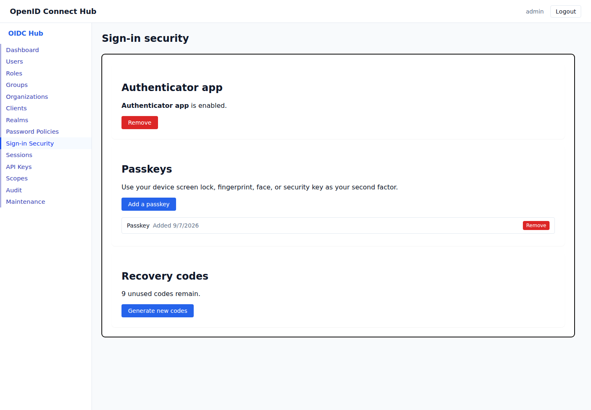

# Multi-factor authentication

[Documentation home](README.md) · [Use cases](README.md#use-cases)

Multi-factor authentication adds a second check after the password. You can use an authenticator app, a passkey, or a one-time recovery code.

## Set up an authenticator app

1. Sign in and open **My Account**, then select **Sign-in Security**.
2. Under **Authenticator app**, select **Set up authenticator**.
3. Add the displayed setup key to your authenticator app.
4. Enter the six-digit code from the app and select **Verify and enable**.
5. Download the recovery codes and store them somewhere private. Each recovery code works once and cannot be displayed again.

The code changes every 30 seconds. If a valid code is refused, check that the time on the device running the authenticator app is set automatically.

## Add a passkey

1. Open **My Account**, then select **Sign-in Security**.
2. Under **Passkeys**, select **Add a passkey**.
3. Follow the browser prompt to use the device screen lock, face, fingerprint, or a security key.

A passkey needs a browser and device that support passkeys. You can register more than one passkey.

## Sign in with MFA

After the password is accepted, choose one of the enrolled methods. The passkey prompt opens automatically when a passkey is available; you can switch to an authenticator or recovery code.

An MFA request expires after five minutes and stops accepting attempts after five failures. Start the sign-in again when either limit is reached. An authenticator code cannot be reused after it has succeeded.

## Use and replace recovery codes

Choose **Recovery code** on the sign-in screen and enter one saved code. Used codes are removed from the remaining count.

To replace the set, open **My Account**, select **Sign-in Security**, and select **Generate new codes**. Replacing the set immediately invalidates every older recovery code. Download the new codes before leaving the page.

## Remove a method

Open **My Account**, select **Sign-in Security**, and select **Remove** beside the authenticator app or passkey. Changing recovery methods requires a session that has recently completed MFA. If the action is refused, sign out, sign in with MFA, and try again.

## Recover a locked-out user

An administrator can open **Users**, select the user, and find **Multi-factor authentication**. **Reset MFA** removes the user's authenticator, passkeys, and recovery codes, then signs the user out everywhere. The user can sign in with their password and enroll a new method.

Reset MFA only after verifying the user's identity through the organization's recovery process.
