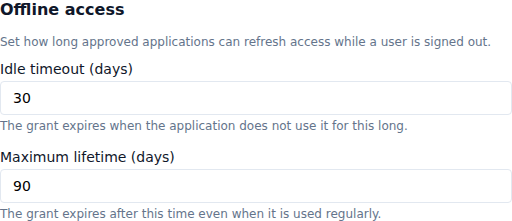
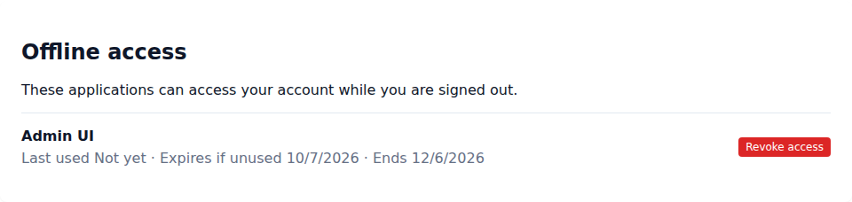

# Manage offline access

Offline access lets an approved application continue working for a user after the user signs out. Common examples include scheduled synchronization, background uploads, and a desktop application that needs to reconnect without opening the sign-in page each time.

The user must approve offline access during an interactive sign-in. An application cannot obtain it through silent sign-in, password credentials, client credentials, device authorization, or token exchange.

## Set the realm lifetime

1. Open **Realms**.
2. Select **Edit** beside the realm.
3. Find **Offline access**.
4. Set the **Idle timeout** and **Maximum lifetime** in days.
5. Select **Save Changes**.

The idle timeout is renewed whenever the application uses its offline grant. The maximum lifetime is measured from the original approval and is never extended. The defaults are 30 days idle and 90 days maximum. The idle timeout cannot be longer than the maximum lifetime.

Changing these settings affects the next renewal. An existing grant always keeps the maximum end date established when the user approved it.

## Allow an application to request offline access

1. Open **Clients**, then select the application.
2. Add `offline_access` to its allowed scopes, or assign an enabled client scope with that name as optional.
3. Save the client.

The application must use the authorization code flow and include `offline_access` in its requested scopes. The approval page explains that the application can retain access while the user is away. Even if the user approved the application before, this request always shows the approval page.

After approval, the token response includes a refresh token and `refresh_expires_in`. Applications must replace the stored refresh token after every successful refresh. Reusing an older token invalidates the complete grant as a theft precaution.

## Review or revoke your offline access

1. Open **My Account**.
2. Select **Offline access**.
3. Review the application, last use, idle expiry, and final end date.
4. Select **Revoke access** when an application should no longer work in the background.

Signing out of a browser does not remove offline access. Revoking the grant here, removing the application under **Applications**, or having an administrator revoke it invalidates every refresh token in that grant immediately.

If an application stops refreshing after a period of inactivity, sign in again and approve a new grant. If a recently used grant stops working, check whether it reached its maximum lifetime or was revoked from **My Account**.
