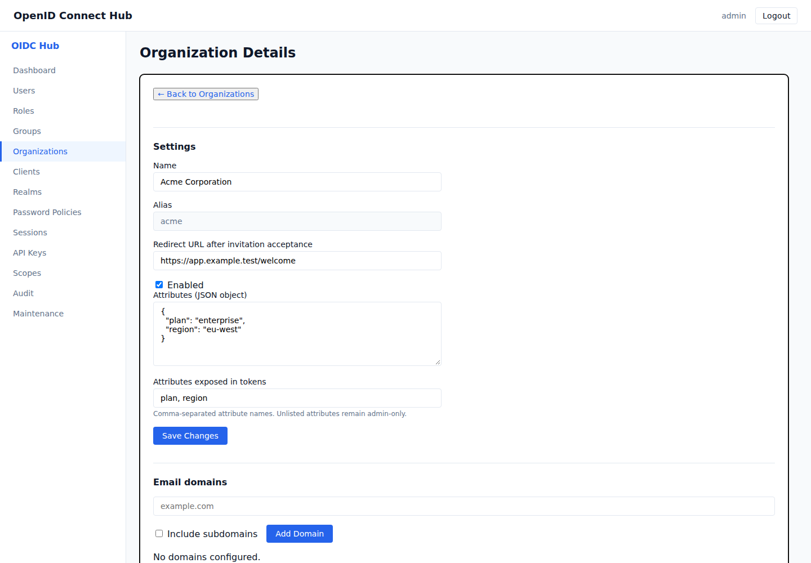
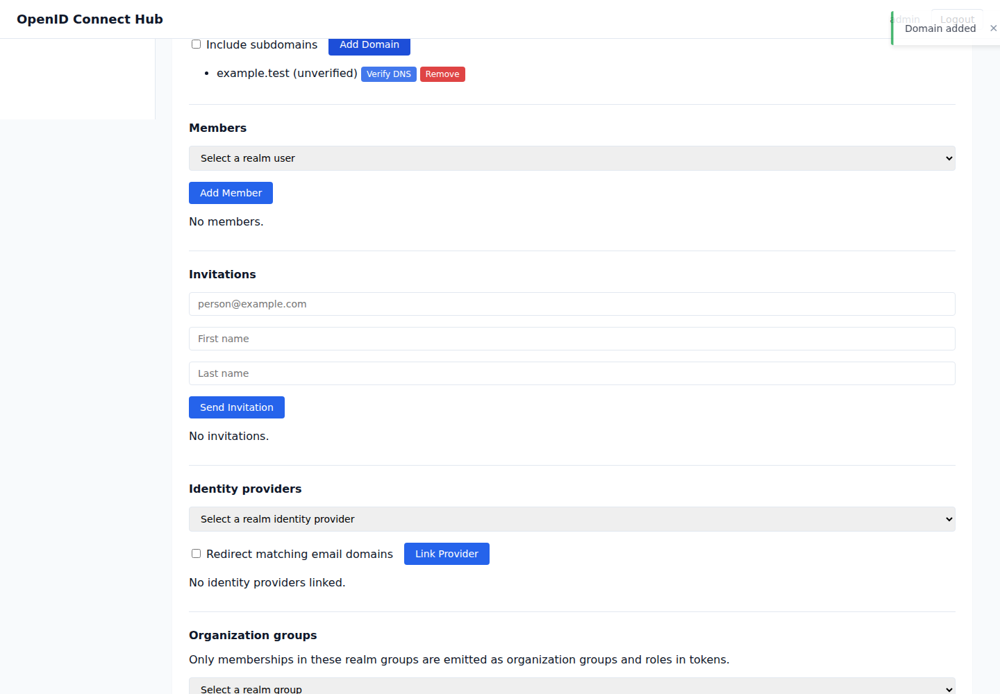

# Organizations

Organizations are business tenants inside a realm. They group members, verified email domains, identity providers, realm groups, and invitations while users and clients remain realm resources.



## Create an organization

1. Sign in to the admin console and open **Organizations**.
2. Select the realm, enter a unique name and alias, and select **Create Organization**.
3. Open the organization to configure it.

The name and alias are unique within the realm. The alias is the stable protocol identifier used in scopes and token claims and cannot be changed after creation. The optional redirect URL sends a member to your application after invitation acceptance and must be an absolute HTTP or HTTPS URL.

**Attributes** contain administrator-defined JSON metadata for the tenant. Use **Attributes exposed in tokens** to list the top-level attribute names that applications may receive. Attributes omitted from that list remain visible only to administrators. Do not expose secrets, credentials, or private operational data in tokens.

## Verify an email domain

1. In **Email domains**, enter a DNS name. Select **Include subdomains** when the organization owns the parent and all subdomains.
2. Select **Add Domain**. Copy the TXT record shown once by the console.
3. Publish the TXT record with your DNS provider.
4. After DNS propagation, select **Verify DNS**.

Domain-based identity-provider discovery only uses verified domains. If verification says the record was not found, check the record name and value, wait for DNS caches to refresh, and retry. To issue a new proof, remove and add the domain again.

## Add members and invitations

Use **Members** to attach an existing realm user. Existing realm users are unmanaged and continue to exist if their membership or organization is removed.

Use **Invitations** to email a time-limited, single-use link. An existing local account confirms with its password. An already signed-in account, including a federated account, can confirm through its browser session. A recipient without an account chooses a strong password and the server creates a verified managed account for the invited address. A pending invitation can be revoked.

Managed accounts created by an organization cannot authenticate or refresh tokens while that organization is disabled. Existing self-contained access tokens remain valid until their normal expiry. Removing their membership or deleting the organization also deletes those accounts. Accounts that already existed in the realm remain unmanaged.

Invitation email delivery must be enabled by the platform administrator. If an invitation does not arrive, verify the recipient address, check the pending invitation in the console, and ask the platform administrator to check email delivery.

## Link identity providers, groups, and roles

Create the realm identity provider first, then link it under **Identity providers**. Enable **Redirect matching email domains** to route login to that provider after the login page discovers a matching verified email domain. A new realm account created by that provider becomes a managed organization member; a pre-existing linked realm account remains unmanaged.

Link realm groups under **Organization groups**. When a member also belongs to a linked group, that group and the roles assigned to it appear inside the organization's token claim. A realm group can be linked to more than one organization.



## Request organization claims

Add `organization` to the client's allowed scopes, then request one of these scopes:

| Scope | Result |
|---|---|
| `organization` | Uses the only membership, or shows an organization picker when the user has several. |
| `organization:<alias>` | Requires membership in the named organization. |
| `organization:*` | Includes every enabled organization membership. |

The formats cannot be mixed. With `prompt=none`, a request requiring a choice returns `account_selection_required`. The `organization` object is emitted in access tokens, ID tokens, UserInfo, and introspection. Each alias contains the organization ID, name, explicitly exposed attributes, applicable organization groups, and their roles.

```json
{
  "organization": {
    "acme": {
      "id": "0199...",
      "name": "Acme Corporation",
      "attributes": { "plan": "enterprise" },
      "groups": ["acme-engineering"],
      "roles": ["developer"]
    }
  }
}
```

## Delegate organization administration

The broad `admin` permission grants full access. Delegated administrators can instead receive `organizations:view`, `organizations:manage`, or `organizations:members` through a role or API-key scope. Append an organization UUID between the resource and action, such as `organizations:0199...:view`, to restrict access to one organization. `view`, `manage`, and `members` are independent permissions; grant every action the administrator needs.
