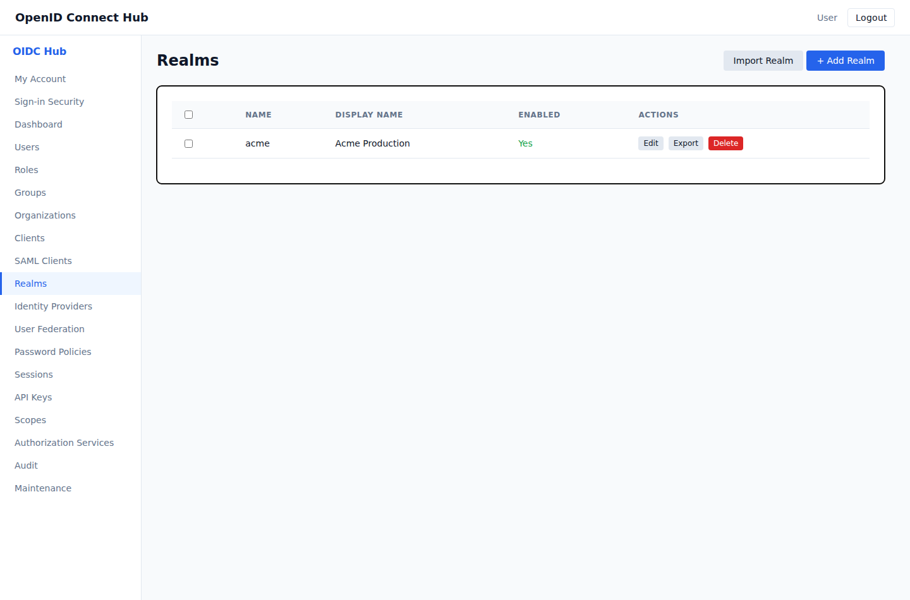
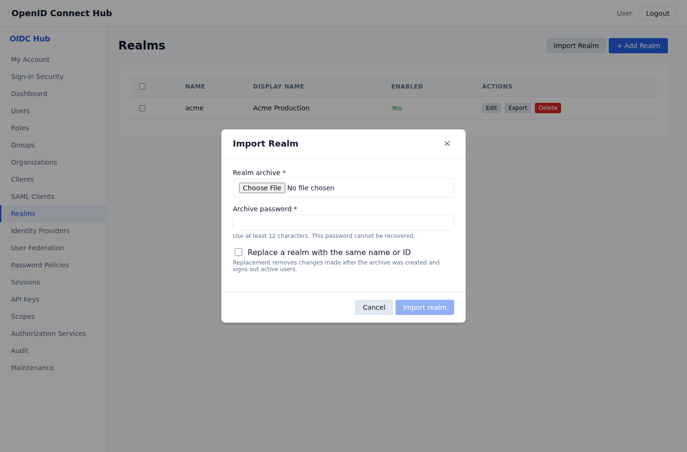

# Back up or move a realm

Realm archives let administrators back up a realm or move it to another OpenID Connect Hub installation. An archive includes the realm settings and its persistent identity configuration:

- users, password hashes, authenticator apps, passkeys, and unused recovery codes;
- applications, signing keys, client scopes, and protocol mappers;
- roles, groups, composite roles, and assignments;
- organizations, domains, memberships, invitations, and identity-provider links;
- OIDC and SAML identity providers, SAML applications, and federation providers;
- API keys, user consent, required actions, accepted terms, and authorization policies.

Temporary login state, active sessions, issued tokens, authorization codes, permission tickets, and audit history are not carried into the imported realm. Users sign in again after a restore.

For a seamless move, expose the destination through the same public sign-in address. If the address changes, update application redirect addresses and identity-provider registrations. Passkeys are tied to the sign-in domain, so users must register new passkeys after a domain change.

## Export a realm

1. Open **Realms** in the administration console.
2. Find the realm and choose **Export**.
3. Enter and confirm an archive password of at least 12 characters.
4. Choose **Download archive** and store the JSON file safely.

The downloaded archive is encrypted. It contains credentials and private signing keys needed to preserve application registrations and user access on the destination installation. The password cannot be recovered, and the archive cannot be imported without it.

## Import a realm

1. Open **Realms** and choose **Import Realm**.
2. Select the exported JSON file.
3. Enter the archive password.
4. Leave **Replace a realm with the same name or ID** cleared when creating the realm on a new installation.
5. Choose **Import realm**.

The import either completes as one operation or leaves the database unchanged. If a realm with the archive's name or ID already exists, the import stops without changing it.

To restore an existing realm, enable **Replace a realm with the same name or ID**. Replacement removes the current realm configuration and persistent identities, restores the archive, and signs out active users. Changes made after the archive was created are lost.

Only a global administrator can import a new realm. A delegated realm administrator with realm read and write permissions can export or replace their own realm.

## Recover from an import problem

- **Incorrect password or modified archive:** enter the password used during export and select the original file again.
- **Realm already exists:** enable replacement only when you intend to restore over that realm. Otherwise remove or rename the conflicting realm before importing.
- **Archive conflict:** an application identifier, key identifier, passkey, invitation, or API-key prefix already exists elsewhere in the destination. Resolve that conflict before retrying.
- **Unsupported version:** create a fresh export with a compatible version of the hub.
