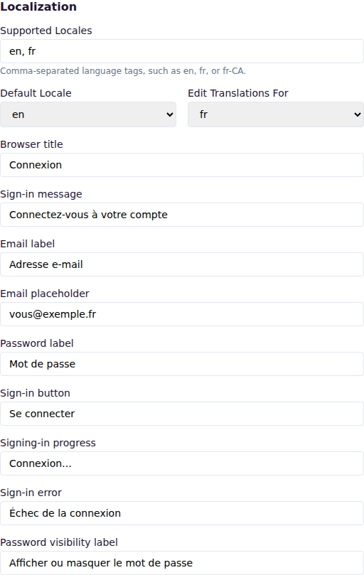
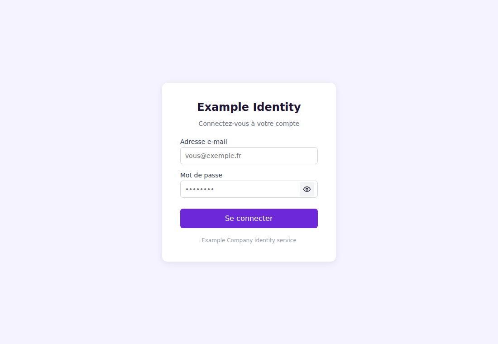
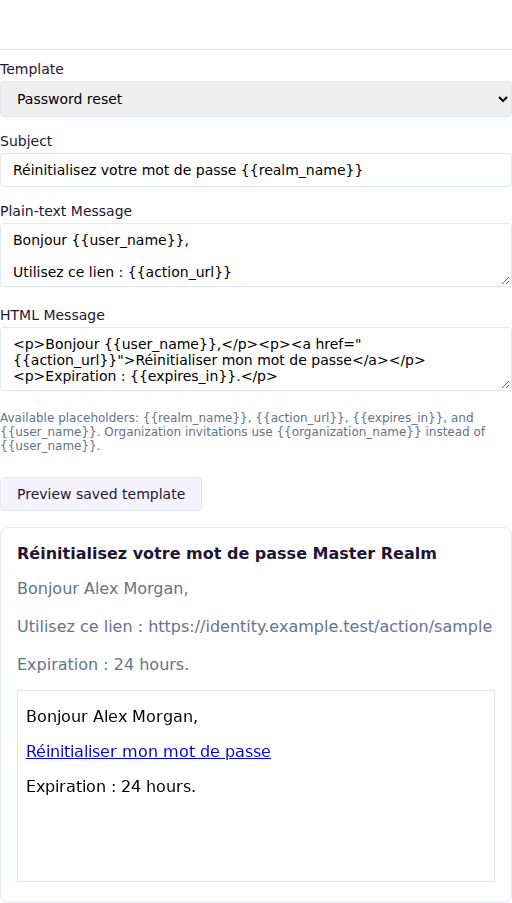

# Customize a realm's appearance and messages

[Documentation home](README.md) · [Use cases](README.md#use-cases)

Realm presentation settings give users a consistent sign-in, account, and administration experience. Administrators can set the visual identity, translate sign-in text, and customize transactional emails independently for each realm.

Open **Realms**, select a realm, and scroll to **Theme**, **Localization**, or **Email Templates**. Save the realm after making changes. Administrators need permission to view the realm to preview templates and permission to manage the realm to save changes.

## Customize the visual theme

In **Theme**, set the title, logo and favicon addresses, primary and background colors, card and text colors, font family, and footer text. Logo and favicon addresses must either use HTTPS or begin with `/` for an asset served from the same site.

Choose **Preview sign-in page** to open the current realm sign-in page. The account console uses the same colors and font after a user signs in. The administration console also applies them while that realm is open.

## Add another language

In **Localization**:

1. Add language tags to **Supported Locales**, separated by commas. For example, enter `en, fr, fr-CA`.
2. Select the **Default Locale** used when no supported language is requested.
3. Select a language under **Edit Translations For**.
4. Enter the translated sign-in labels and messages. Leave a field empty to use its built-in text.
5. Choose **Save Changes**.

The sign-in page first considers the application's requested language, then the browser language, and finally the realm default. A regional request such as `fr-CA` can use the supported `fr` translation.

## Customize an email template

In **Email Templates**, select the language and one of these messages:

- password reset;
- email verification;
- organization invitation.

You can customize the subject, plain-text message, and HTML message. An empty field uses the built-in version. Password reset and verification messages use the user's profile language; invitations use the realm default language.

Templates support `{{realm_name}}`, `{{action_url}}`, and `{{expires_in}}`. Password reset and verification also support `{{user_name}}`; invitations support `{{organization_name}}`. Saving is rejected if a template contains an unknown or unfinished placeholder.

Save the realm, then choose **Preview saved template**. The preview uses sample names and an inactive sample link, so it does not send an email or expose user data.

## Troubleshooting

- If the sign-in page uses the default wording, confirm that the requested language appears in **Supported Locales** and that you saved the realm.
- If a logo or favicon is rejected, use an HTTPS address or a root-relative address.
- If an email cannot be saved, check every placeholder against the list shown below the editor and make sure each opening `{{` has a closing `}}`.
- If messages are rendered correctly in the preview but are not delivered, check the email delivery configuration and provider logs.

Presentation settings are included automatically in realm exports and restored during realm imports.
