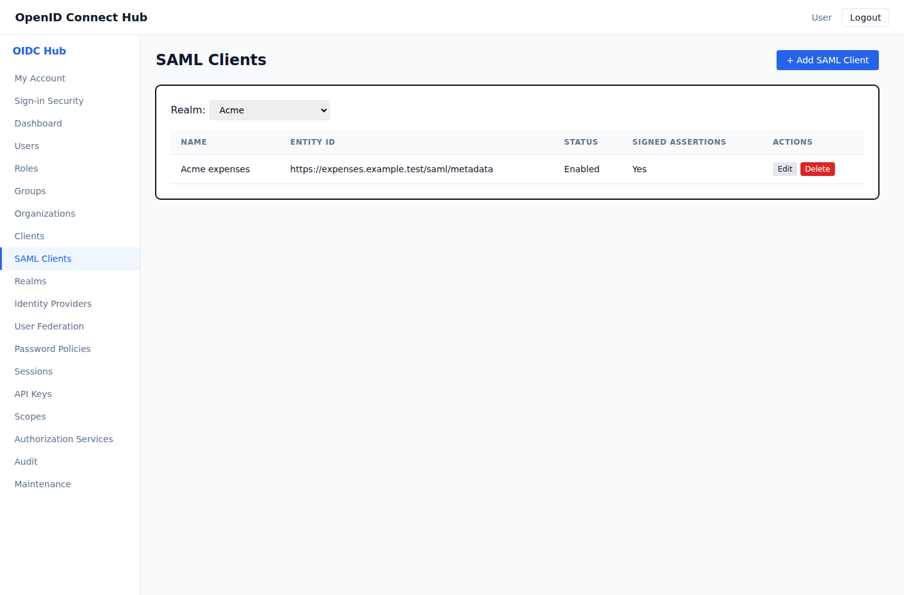
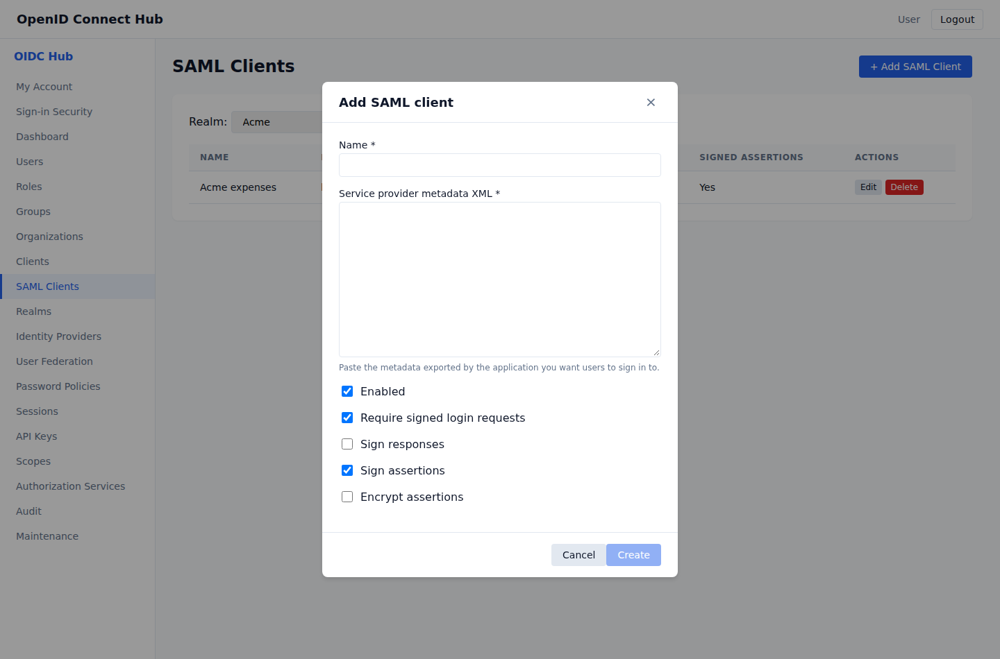

# Connect applications and identity providers with SAML 2.0

The hub can sign users into SAML applications and can accept sign-in from an external SAML identity provider. Both configurations use metadata XML so endpoints and certificates are exchanged together.

## Connect a SAML application

1. In the application, create a SAML identity-provider connection and copy its service-provider metadata XML.
2. Open **SAML Clients** in the administration console.
3. Select the realm and choose **Add SAML Client**.
4. Enter a recognizable name and paste the service-provider metadata.
5. Keep **Require signed login requests** and **Sign assertions** enabled unless the application explicitly requires different settings.
6. Enable **Encrypt assertions** only when the imported metadata contains an encryption certificate.
7. Choose **Create**.



Give the application this identity-provider metadata URL:

```text
https://login.example.com/realms/{realm}/protocol/saml/descriptor
```

The metadata advertises Redirect and POST sign-in, signed single logout, supported NameID formats, and the realm certificate. The first metadata request creates the realm certificate. Keep the same database and encryption key so existing application registrations continue to trust it.



## Choose signing and encryption settings

- **Require signed login requests** rejects unsigned requests from the application.
- **Sign responses** signs the outer SAML response. Some applications require this in addition to a signed assertion.
- **Sign assertions** signs the user assertion and is enabled by default.
- **Encrypt assertions** encrypts the assertion with the certificate in the application's metadata.

The hub checks the issuer, destination, registered assertion consumer URL, requested binding, signature algorithm, timestamps, audience, and request correlation before issuing or accepting an assertion. A SAML request state is valid for ten minutes and can be used once.

## Connect an external SAML identity provider

1. Open **Identity Providers**.
2. Select the realm and choose **Add Provider**.
3. Choose **SAML 2.0**, enter a stable alias, and paste the provider's metadata XML.
4. Choose whether new users may be created automatically and whether a verified email may link to an existing account.
5. Choose **Create**.
6. In the external provider, import the hub service-provider metadata:

```text
https://login.example.com/realms/{realm}/protocol/saml/broker/{alias}/metadata
```

The assertion consumer URL and logout URL are included in that metadata. When an organization domain is linked to this provider, users with that verified email domain are sent to it from the normal sign-in page.

Incoming assertions must be signed. The hub verifies the response against the certificates in the imported metadata, rejects assertions for another audience or destination, correlates the response with the original request, and prevents reuse of an assertion ID. The upstream NameID becomes the stable federated identity. Email, `firstName`, and `lastName` attributes populate the local profile when supplied.

## Single logout

Applications and external identity providers can send signed logout requests through the endpoints advertised in metadata. The matching local session is revoked, the browser session is cleared, and a signed logout response is returned through the same binding.

## Troubleshooting

- **Invalid SAML metadata:** export fresh metadata from the peer and paste the complete `EntityDescriptor` document, including its certificate and sign-in endpoint.
- **Invalid or unsigned request:** confirm that the peer uses the metadata currently published by the hub and signs requests with the certificate in its metadata.
- **Unknown service provider:** confirm that the request issuer exactly matches the imported entity ID and that the client is enabled.
- **Encryption certificate required:** add an encryption certificate to the application's metadata or turn off assertion encryption.
- **Expired or already used:** start sign-in again. Login state and assertions cannot be replayed.
