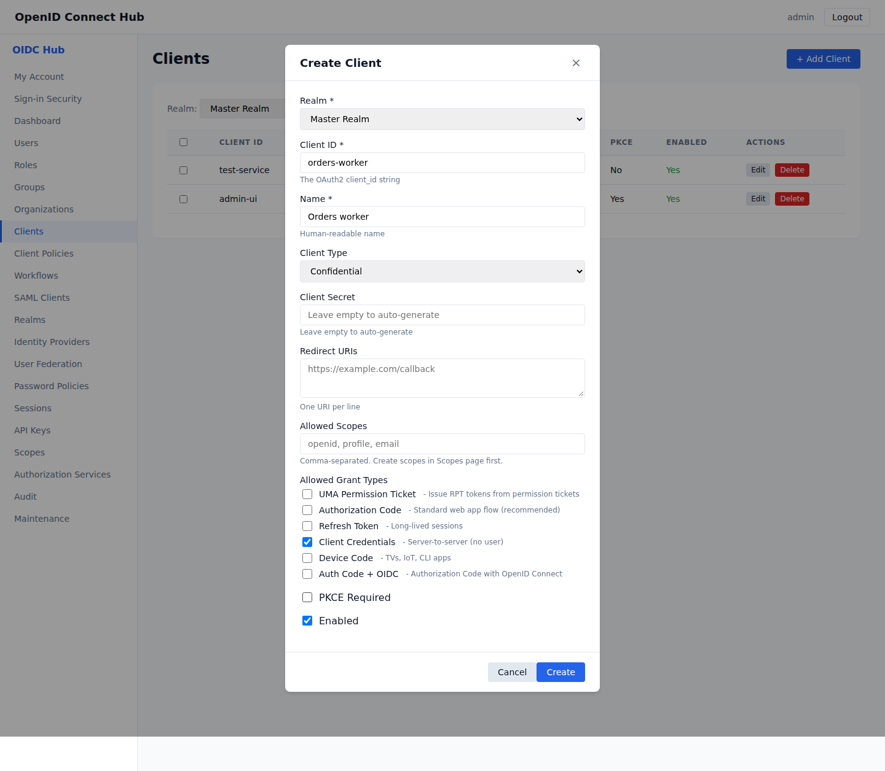

# Use service accounts and agent identities

[Documentation home](README.md) · [Backend-service use case](use-cases/backend-service.md) · [Agent use case](use-cases/agent-identity.md)

The hub uses standard OAuth clients for workloads. There is no separate human-looking service-user account to maintain.

## Backend service without a user

Create a confidential client with the `client_credentials` grant:



1. Open **Clients** and choose **Add Client**.
2. Select the target realm and enter a stable client ID such as `invoice-worker`.
3. Choose **Confidential**.
4. Select **Client Credentials** as the allowed grant.
5. Select only the scopes needed by the downstream API.
6. Leave the secret blank to generate one, create the client, and immediately store the copied secret in the workload's secret manager.

Request a token from the realm token endpoint using HTTP Basic authentication:

```sh
curl --fail-with-body \
  --user "$CLIENT_ID:$CLIENT_SECRET" \
  --header "Content-Type: application/x-www-form-urlencoded" \
  --data-urlencode "grant_type=client_credentials" \
  --data-urlencode "scope=orders.read" \
  "https://identity.example.com/realms/$REALM/protocol/openid-connect/token"
```

The response contains a bearer access token valid for 15 minutes and no refresh token. Request a new token when needed. The subject identifies the client, and UserInfo rejects this token because no person is involved.

## Agent acting independently

Use the same Client Credentials pattern for an unattended software agent. Give each deployed agent or trust boundary a separate client ID so audit and revocation remain precise. Add a protocol mapper when a downstream API needs a stable agent type, deployment, or audience claim.

Do not share one client secret between unrelated agents. Disabling one client should stop only that agent.

## Agent acting for a person

When an agent performs work on behalf of a person, obtain user authorization instead of silently using the agent's own token:

- Use Authorization Code with PKCE for an agent that can open a browser.
- Use Device Authorization for a command-line or input-constrained agent.
- Use CIBA when the person should approve from another signed-in device.
- Request `offline_access` only when the person understands and approves continued access after browser logout.

The resulting user token preserves user identity and consent. See [offline access](offline-access.md) and [CIBA](ciba.md) for their lifecycle rules.

## Agent administering the hub

Client Credentials tokens are intended for application APIs. For an agent that creates users, runs workflows, or calls another hub administration endpoint, create a realm-scoped [administration API key](api-keys.md) with the smallest required permissions.

Keep application client secrets and administration API keys in separate secret entries. They authorize different resources and need separate replacement schedules. API keys support rotation with a 24-hour grace period. For an OIDC client secret, create a replacement client, move the workload, verify it, and disable the old client.

## Protect the downstream API

The API must validate signature, issuer, audience, expiry, and required scopes on every request. Use an audience protocol mapper when the API needs its own `aud` value. For resource and context-based decisions, use [Authorization Services](authorization-services.md).
