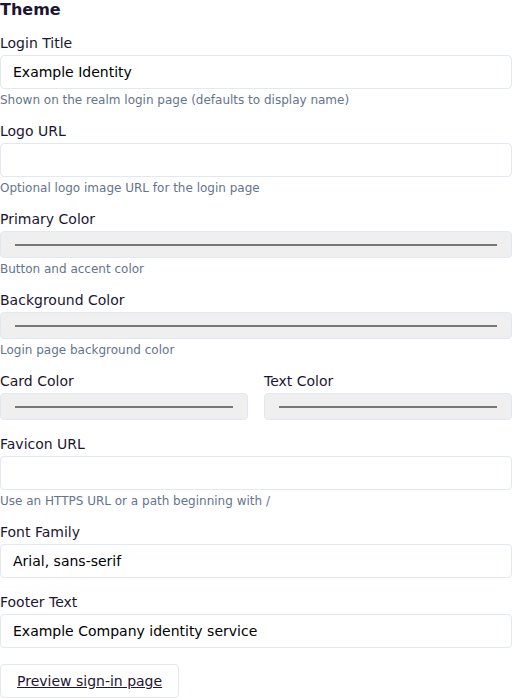

# Use case: build a customer identity realm

[Documentation home](../README.md) · [Getting started](../getting-started.md) · [User account console](../user-account-console.md)

Use this journey for a customer-facing website or application where customers sign in, manage their own account, and approve application access.

## Outcome

Customers authenticate through a branded realm, use local or upstream identity, complete verification and MFA when required, review consent, and recover their account through configured email.

## A. Create the customer realm

1. Create a realm dedicated to the customer population.
2. Configure brand colors, logo, sign-in title, supported locales, and email templates.
3. Configure transactional email delivery.
4. Set password and authentication-flow policy.

Separate a customer realm from workforce administration when the populations require different administrators, applications, policies, or signing keys.

## B. Register customer applications

Create one client per application and environment. Use Authorization Code with S256 PKCE. Register exact redirect and logout addresses, and allow only necessary profile scopes.

Use client roles for product entitlements and protocol mappers for stable application claims. Use organizations when business customers need tenant membership and enterprise identity providers.

## C. Add identity providers

Configure an upstream OIDC or SAML identity provider when customers can sign in through another provider. Test linking and new-user creation with non-production accounts. For enterprise customers, link the provider to their organization and verify its email domain.

## D. Configure customer security

Require email verification before sensitive use. Offer authenticator apps, passkeys, and recovery codes. Use step-up MFA for sensitive clients or scopes instead of requiring the same assurance for every visit.

## E. Provide self-service

Direct signed-in customers to **My Account**, where they can update their profile and password, manage sign-in methods and linked identities, end sessions, and revoke application or offline access.

## F. Test recovery and privacy

Test password reset, email verification, recovery codes, session revocation, consent grant and revocation, account lockout, and localized templates. Confirm tokens contain only the claims needed by each application.

## Completion check

- Branding and language are correct throughout sign-in and email.
- Password reset and verification messages arrive with valid public links.
- MFA enrollment, challenge, recovery, and administrator reset work.
- Customers can review sessions, applications, and offline grants.
- Revoking consent or a session has the expected application effect.
- Applications reject tokens from the workforce or another customer realm.
