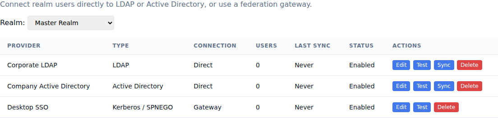

# Use case: connect an enterprise directory

[Documentation home](../README.md) · [User federation](../user-federation.md)

Use this journey when LDAP or Active Directory remains the source of employee identities and passwords, or when browsers use Kerberos sign-in.

## Outcome

Directory users authenticate in the realm without copying their passwords into the hub. Selected profile and group data synchronize, and operators have tested how sign-in behaves during a directory outage.

## A. Prepare the directory

1. Create a read-only service account that can search the required users and attributes.
2. Choose a stable identifier: `entryUUID` for LDAP or `objectGUID` for Active Directory.
3. Identify the base DN, login filter, synchronization filter, and profile and group attributes.
4. Enable LDAPS or StartTLS and collect the public CA certificate when the directory uses a private CA.
5. Select a small pilot group that includes an enabled user, a disabled user, and representative group memberships.

For Kerberos, deploy and validate the [federation gateway](../federation-gateway-api.md) with access to its service key before continuing.

## B. Configure the provider

1. Open **User Federation**, select the realm, and add LDAP or Active Directory.
2. Choose **Direct directory connection**, enter the directory URL, and enter the service-account bind password.
3. Configure the base DN, bind DN, filters, stable ID, username, email, profile, and group attributes.
4. Enable user import and group synchronization.
5. Save and choose **Test**.

For Kerberos, choose **Federation gateway** and enter its HTTPS URL and shared secret.

## C. Run the pilot

1. Sign in as a pilot user and confirm that the account is linked without a local password.
2. Confirm mapped profile values, custom attributes, and group memberships.
3. Confirm realm roles inherited through synchronized groups.
4. Confirm that MFA and required actions still run after directory authentication.
5. Run **Sync**, rename a pilot user's username or DN in the directory, and confirm that the stable ID updates the existing account.
6. Confirm that a disabled Active Directory user cannot sign in.

Enable `link_existing_users` only after confirming that the directory controls the email namespace. Test a duplicate email before synchronizing the full population.

## D. Prepare operations

1. Test an incorrect user password and an expired service-account password.
2. Block directory network access briefly and confirm that local or other enabled providers behave as expected.
3. Test an invalid and wrong-host TLS certificate in a non-production environment.
4. Record how to replace the bind password and private CA certificate.
5. Disable the provider and confirm that linked records remain while directory sign-in stops.
6. For Kerberos, also test clock skew, an expired service key, and a rejected Negotiate ticket.

The current synchronization updates and adds users and memberships. Use lifecycle workflows or your directory event process to disable departed users; do not assume that a user missing from one synchronization run is automatically disabled.

## Completion check

- The connection test succeeds over the selected encrypted transport.
- Correct and incorrect passwords produce the expected result.
- Stable IDs preserve links across username, email, and DN changes.
- Imported attributes and group access have been reviewed.
- Duplicate email, disabled account, outage, and credential-rotation behavior is documented for operators.
