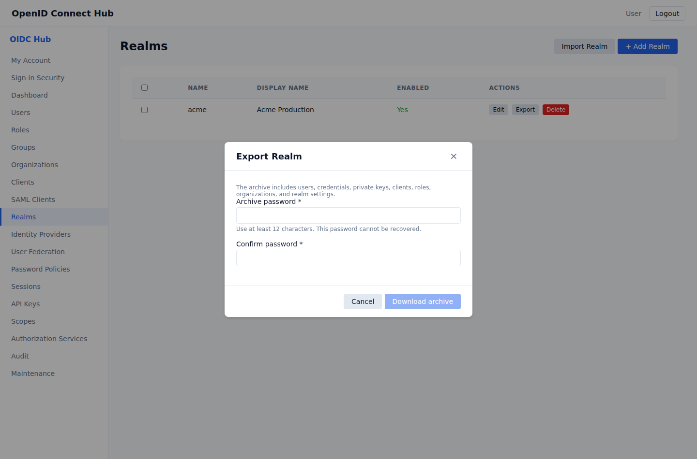

# Use case: back up, migrate, and recover a realm

[Documentation home](../README.md) · [Realm import and export](../realm-import-export.md) · [Operations](../operations.md)

Use this journey to create a recoverable realm archive, restore a damaged realm, or move it to another deployment.

## Outcome

An encrypted archive restores persistent identities and configuration, users sign in again, and applications are validated before traffic returns.

## A. Prepare the backup

1. Open **Realms**, choose **Export**, and set a unique archive password of at least 12 characters.
2. Download the encrypted JSON archive.
3. Store the archive and password in separate protected locations.
4. Record the hub version, public sign-in address, and backup time.
5. Test restoring the archive regularly; a download alone is not a recovery test.

The archive includes persistent users, credentials, clients, signing keys, roles, organizations, federation settings, consent, policies, and API keys. It excludes active sessions, issued tokens, transient protocol state, audit history, and workflow execution history.

## B. Restore or migrate

1. Open **Realms → Import Realm** on the destination.
2. Select the archive and enter its password.
3. Leave replacement disabled for a new destination realm.
4. Enable replacement only when the current matching realm must be removed and restored atomically.
5. Keep the same public sign-in address when possible. If it changes, update application callbacks and external identity-provider registrations; users must register new passkeys after a domain change.

## C. Validate before reopening access

Test local and federated sign-in, MFA, signing-key discovery, browser and service clients, roles and groups, organizations, email, API keys, authorization policies, and workflow definitions. Expect users to sign in again because sessions are not restored.

## Completion check

- A recent archive can be decrypted and imported in a test environment.
- Replacement data-loss behavior is understood and approved.
- Application and identity-provider callbacks match the destination address.
- Recovery owners, archive location, password location, and validation steps are documented.

