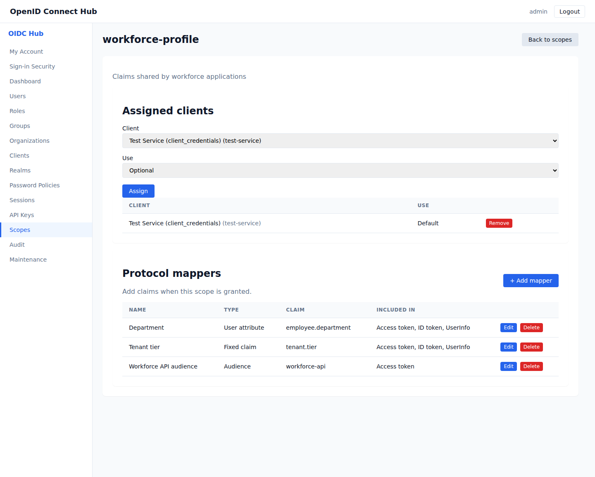

# Use case: connect a web application with single sign-on

[Documentation home](../README.md) · [Application integration](../application-integration.md) · [Claims and scopes](../client-scopes-and-protocol-mappers.md)

Use this journey for a browser application or a server-rendered application that signs in people through OpenID Connect.

## Outcome

The application redirects users to the correct realm, receives an authorization code, validates tokens, enforces application roles, and signs users out safely.

## A. Register the application

1. Open **Clients** and create the client in the user population's realm.
2. Choose **Public** for a browser-only application or **Confidential** for a backend that can keep credentials.
3. Enable Authorization Code and keep S256 PKCE required.
4. Register exact HTTPS callback and post-logout addresses.
5. Allow only the scopes the application uses.
6. Store the generated secret when the client is confidential.

## B. Model application access

1. Create client roles such as `reader`, `editor`, and `administrator`.
2. Assign roles to user groups or include them in composite roles.
3. Assign a client scope with a client-role mapper if the application needs a custom role claim.
4. Add an audience mapper for the protected backend API.

## C. Configure the application

Configure its OIDC library with the realm issuer, client ID, callback address, and requested scopes. Enable state, nonce, issuer, signature, audience, and expiry validation. Keep the client secret on the server side.

## D. Exercise sign-in and consent

1. Start sign-in from the application.
2. Complete password, MFA, required-action, organization-selection, and consent screens as configured.
3. Exchange the code once and create the application's local session.
4. Verify expected `sub`, `iss`, `aud`, scope, role, and organization claims.

## E. Exercise renewal and logout

Test access-token expiry, refresh when enabled, session revocation, and logout. The application must clear its local cookie when it signs out, even if a remote notification fails.

## Completion check

- An unknown redirect URI is rejected.
- Public code exchange requires S256 PKCE.
- Tokens from a different realm or audience are rejected.
- Users without the required client role receive no application access.
- Consent revocation and session revocation take effect as expected.
- Logout clears the application session.
