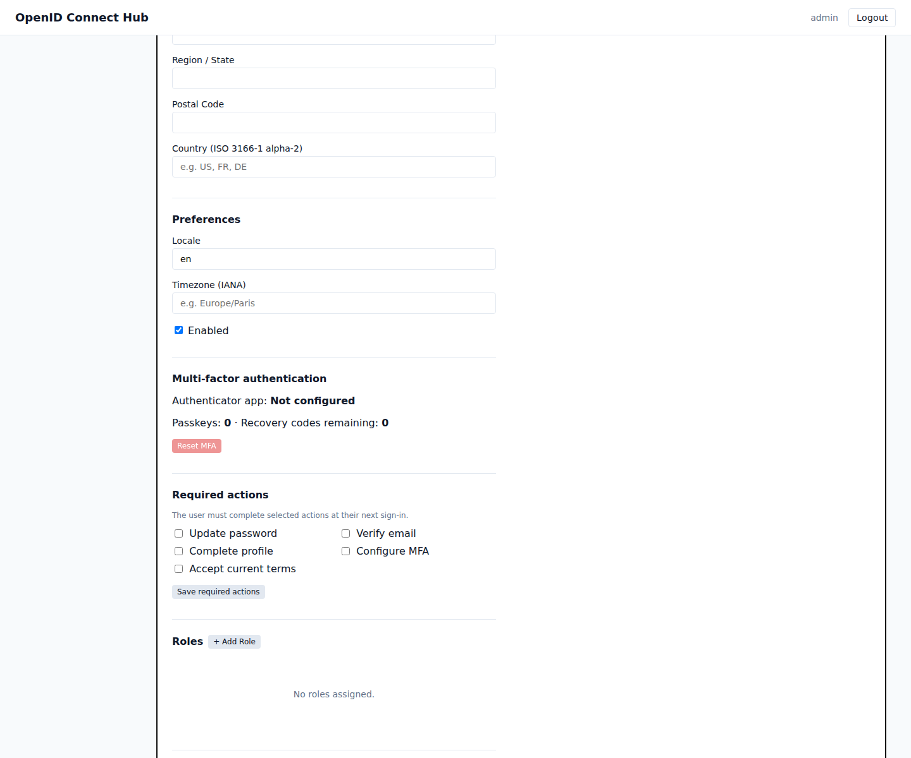

# Use case: manage a workforce user lifecycle

[Documentation home](../README.md) · [User management](../user-management.md) · [Workflows](../workflows.md)

Use this journey when the hub manages employees, contractors, association members, or another internal population.

## Outcome

People receive access through groups and roles, complete the required security setup at first sign-in, manage their own account, and lose access consistently when they leave.

## A. Design the realm

1. Create one realm for the workforce population.
2. Configure password policy, MFA requirements, profile requirements, terms, and session behavior.
3. Configure email delivery and realm presentation.
4. Connect an LDAP or Active Directory provider when the directory remains the source of truth; otherwise use local users.

Keep external directory ownership clear. Avoid manually changing identity data that the next synchronization will replace.

## B. Model access

1. Register the applications employees will use.
2. Create client roles for application-specific permissions such as `payroll-viewer`.
3. Create realm roles for shared responsibilities such as `employee` or `support-staff`.
4. Create groups for departments, teams, or locations.
5. Assign roles to groups and use composite roles for standard job profiles.

## C. Onboard a person

1. Create or synchronize the user.
2. Add the user to their groups.
3. Add exceptional direct roles only when needed.
4. Assign required actions: change initial password, verify email, complete profile, configure MFA, and accept terms.
5. Ask the user to sign in and open **My Account** to review profile, sessions, applications, and sign-in methods.

## D. Automate lifecycle changes

Create workflows for repeatable policies, for example:

- On `user.created`, add standard required actions.
- On a chosen lifecycle event, add or remove a role or group.
- On an inactivity schedule, disable an account and revoke sessions.

Configure the external wake-up call when a workflow contains a schedule or delayed step.

## E. Handle moves and support

For a team move, change group membership and issue a new token. For lost MFA, use the user's **Reset MFA** action and have the user enroll again. For suspected compromise, disable the account, revoke sessions and offline grants, then review Audit.

## F. Offboard

1. Disable the user at the required termination time.
2. Revoke active sessions and offline grants.
3. Remove group and direct-role assignments.
4. Revoke linked application access when required.
5. Retain or delete the account according to organizational policy.
6. Review Audit to confirm every step.

## Completion check

- A new worker receives the intended roles through groups.
- First sign-in cannot finish until required actions are complete.
- MFA and account recovery have been tested.
- A role removal is visible after a new token is issued.
- Disabling and revoking sessions prevents new access.
- The offboarding sequence is documented or automated.
