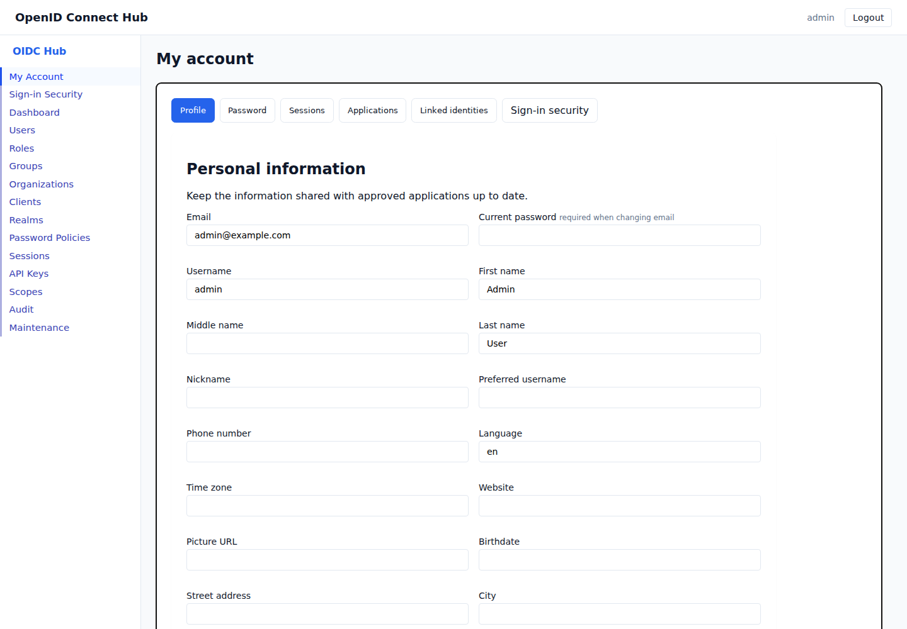
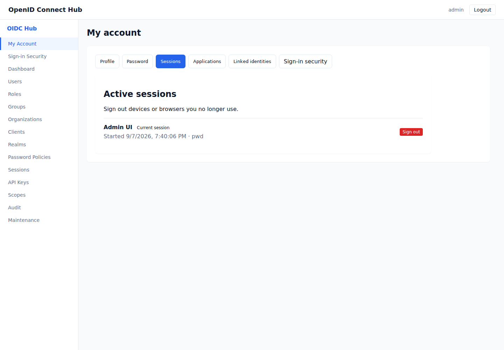
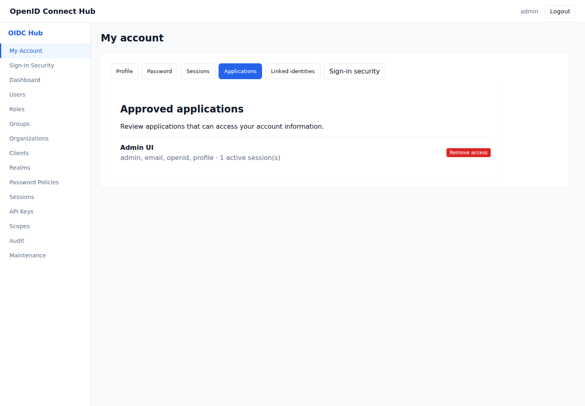

# Manage your account

The account console lets you update the information associated with your account, change your password, review active sessions and offline access, remove application access, and manage linked sign-in methods.

Open **My Account** after signing in.

## Update your profile

1. Open **My Account**, then select **Profile**.
2. Update the fields you want to change.
3. Select **Save profile**.

Changing your email address also requires your current password. The new address is marked unverified until you complete email verification. An email address already used by another account cannot be selected.

Profile information may be shared with applications you approve. Leave an optional field empty to remove its value.

## Change your password

1. Select **Password**.
2. Enter your current password.
3. Enter and confirm the new password.
4. Select **Change password**.

The new password must meet the realm's password policy. A successful change signs out your other sessions while keeping the current session active.

Accounts that sign in only through an external identity provider do not have a local password to change.

## Review and end sessions

Select **Sessions** to see the browsers and applications currently signed in to your account. The session used to view the page is labeled **Current session**.

Select **Sign out** beside a session you no longer recognize or use. Signing out the current session returns you to the login page.

## Review offline access

Select **Offline access** to see applications that can continue accessing your account while you are signed out. Each entry shows its last use, idle expiry, and final end date. Select **Revoke access** to invalidate the application's complete offline grant.

Browser sign-out does not remove an offline grant. See [Manage offline access](offline-access.md) for approval, lifetime, and recovery guidance.

## Review application access

When an application asks you to approve access, review the information it requests before selecting **Allow**. Approved access appears under **Applications** together with its scopes and active session count.

Select **Remove access** to revoke the saved approval and sign out every active session for that application. The application must request approval again before it can regain access.

## Manage linked identities

Select **Linked identities** to review external accounts that can be used to sign in. Select **Unlink** to remove one.

The console prevents removal of the last available sign-in method. Add a local password or another external identity before unlinking the only external identity from an account without a password.

## Manage sign-in security

Select **Sign-in security** to add or remove an authenticator app or passkey and to replace recovery codes. See [Multi-factor authentication](multi-factor-authentication.md) for the complete workflow.

If the account console reports that your session is no longer valid, sign in again. This can happen after you end the current session, remove access for the application you are using, or an administrator signs out your account.
