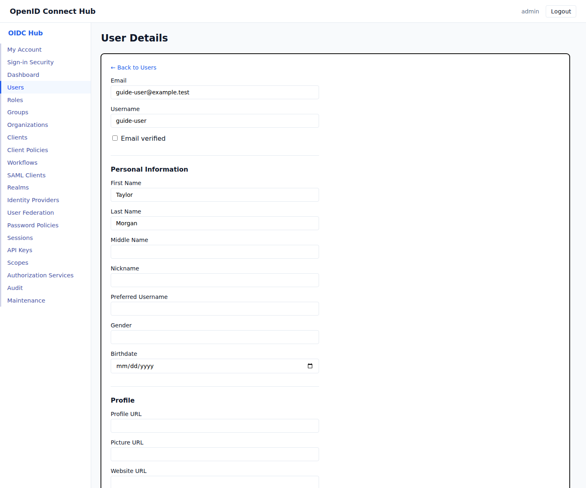

# Manage users from onboarding to offboarding

[Documentation home](README.md) · [Workforce use case](use-cases/workforce-user-lifecycle.md) · [User account console](user-account-console.md)

This guide covers locally managed users. For people sourced from a directory, see [user federation](user-federation.md). For customer-company membership, see [organizations](organizations.md).

## Prepare reusable access

Create roles before onboarding users. Use realm roles for access shared across applications and client roles for one application. Create groups for teams or departments, assign roles to those groups, and then add users to groups.

This arrangement lets an administrator change a team's access once instead of editing every member. See [client and composite roles](client-and-composite-roles.md) for effective-role behavior and token claims.

## Create a user

1. Open **Users** and select the realm.
2. Choose **Add User**.
3. Enter a valid email address and an initial password of at least eight characters. Add a username and profile fields when required.
4. Leave **Enabled** selected unless the account is being prepared for a later start date.
5. Create the user, then open the user from the list.

Email addresses must be unique within a realm. A new account's email is initially unverified.

## Complete onboarding

On the user details page:

1. Review the profile and enabled state.
2. Under **Required actions**, select **Update password** so the initial password is replaced at first sign-in.
3. Select **Verify email**, **Complete profile**, **Configure MFA**, or **Accept current terms** when those actions are required, then choose **Save required actions**.
4. Under **Groups**, add the user's team or department.
5. Under **Roles**, add exceptional access that should not come from a group.

Required actions block token completion until the user finishes them. Their order and realm-wide requirements are described in [authentication flows](authentication-flows.md).

## Change a user's access

Use group membership for routine moves between teams. Add or remove direct roles for individual exceptions. Composite roles and group roles are expanded when the hub evaluates permissions and issues new tokens.

An access token already issued to the user does not change. Revoke the user's sessions when an access reduction must take effect before the current token naturally expires.

## Help a locked-out user

- If the user lost every MFA method, open the user and choose **Reset MFA**. This removes their authenticator apps, passkeys, and recovery codes and revokes active sessions.
- If the password must change, assign **Update password**. For a forgotten password, use the configured password-reset email flow.
- If the account is disabled, review why it was disabled before enabling it.
- Review **Audit** to find the actor and event associated with recent administrative changes.

## Review and end sessions

Open **Sessions** to list active sessions and revoke one or several. Revocation forces the affected client session to authenticate again. Users can also end their own sessions from **My Account**.

Offline grants are separate from normal browser sessions. Review and revoke those grants as described in [offline access](offline-access.md).

## Offboard a user

For a reversible suspension:

1. Disable the user.
2. Revoke active sessions.
3. Remove sensitive group and role assignments if policy requires it.
4. Revoke offline application access.
5. Confirm the changes in **Audit**.

Delete the user only when your retention policy allows permanent removal. Organization-managed accounts can also be removed when their organization membership or organization is deleted; review [organization membership behavior](organizations.md#add-members-and-invitations) first.

For repeatable onboarding, inactivity, and offboarding rules, use [workflows](workflows.md).
