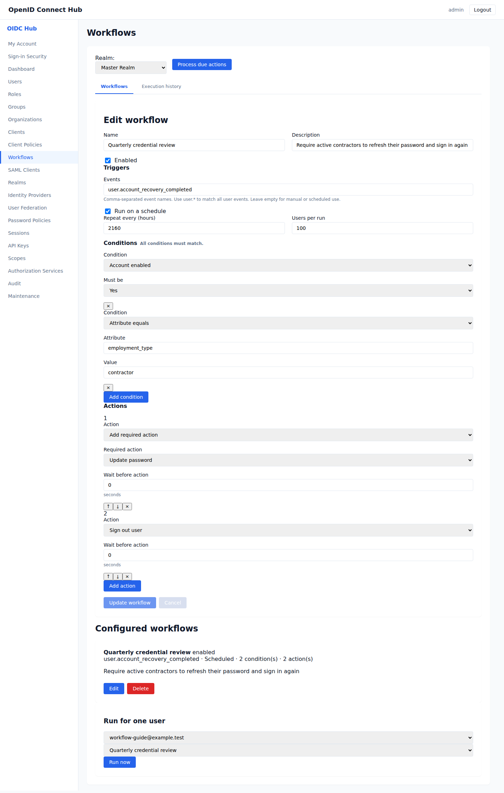
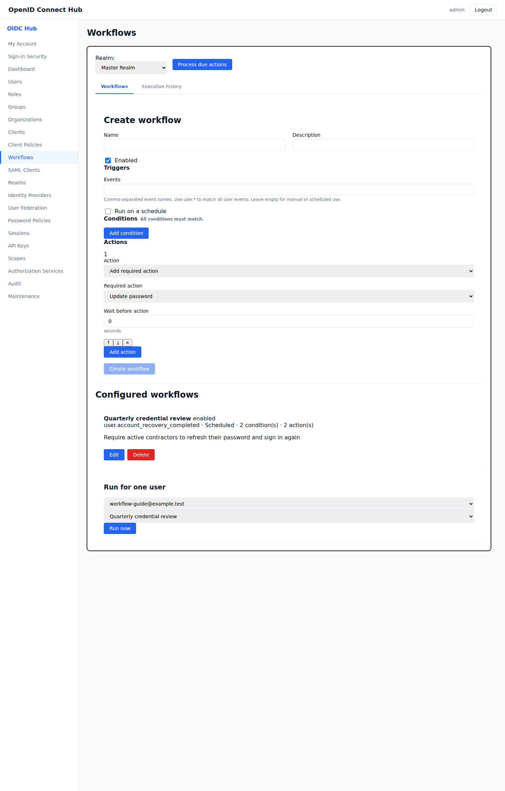
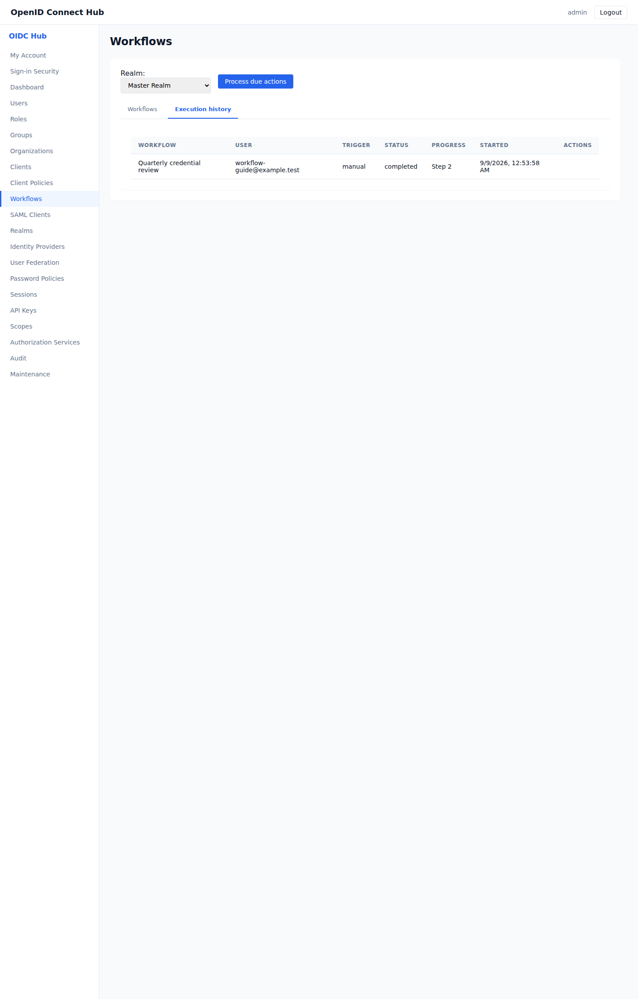

# Automate user lifecycle tasks

[Documentation home](README.md) · [Use cases](README.md#use-cases)

Workflows let realm administrators apply a sequence of actions when a user event occurs, on a schedule, or when an administrator starts the workflow for one user. Every execution is recorded so delayed, failed, and completed work can be reviewed.

Open **Workflows** in the administration console and select a realm.

## Create a workflow

Enter a name and optional description. An enabled workflow can use any combination of these triggers:

- **Events** start the workflow when a matching user event is recorded. Enter exact names such as `user.created`, `user.authenticated`, `user.role_assigned`, or `user.account_recovery_completed`. Use `user.*` to match every user event.
- **Run on a schedule** checks eligible users at the selected interval. **Users per run** limits each batch. Users that have waited longest are considered first.
- **Run now** starts an enabled workflow for the user selected below the workflow list.

A workflow with no event or schedule remains available for manual use.



## Select users with conditions

Add conditions when the actions should apply only to some users. All configured conditions must match. You can check:

- whether the account is enabled;
- whether the email address is verified;
- whether a user attribute has a particular value;
- how many days the user has been inactive;
- whether the user has a role;
- whether the user belongs to a group.

Leave the conditions empty to apply the workflow to every user reached by its trigger.

## Build the action sequence

Actions run from top to bottom. Use the arrow buttons to change their order. Each action can run immediately or wait for a number of seconds before it begins.

Available actions are:

- enable, disable, or delete the user;
- add or remove a required action, including password update, email verification, profile update, MFA configuration, and terms acceptance;
- sign the user out by revoking active sessions;
- set or remove a user attribute;
- grant or revoke a role;
- add the user to a group or remove the user from a group.

A common credential review workflow adds **Update password** and then signs the user out. The user must choose a new password at the next sign-in.

Choose **Create workflow**. The configured workflow appears below the editor and can be edited, disabled, or deleted.



## Process scheduled and delayed actions

Choose **Process due actions** to start scheduled batches and continue actions whose waiting period has ended.

Scheduled and delayed work needs a periodic wake-up. The application does not keep a timer running by itself: an external scheduler must regularly call the authenticated operation.

### Create the scheduler credential

Use a dedicated API key for the scheduler:

1. Sign in to the administration console with an account allowed to create API keys.
2. Open **API Keys** in the left menu and choose **Create Key**.
3. Select the same realm as the workflows, enter a name such as `Workflow scheduler`, and select only `workflows:execute` under **Permissions**.
4. Set an expiration period that matches your key rotation policy and choose **Create Key**.
5. Copy the generated key immediately and save it in the secret store used by your scheduler. The complete key is shown only once. If it is lost, rotate the key from **API Keys** and save the replacement.

This generated API key is the credential used below. It is not a user password or an OIDC client secret. The key is restricted to the realm selected when it was created.

Open **Realms**, select the realm, and copy the UUID at the end of the browser address when you need the `{realm_id}` value.

### Configure the scheduled call

```http
POST /api/realms/{realm_id}/workflows/run-due
X-API-Key: <scheduler API key>
Content-Type: application/json

{"limit":500}
```

Each call starts scheduled workflows that are due and resumes delayed executions whose waiting period has ended. Calling it when nothing is due has no effect.

For example, a scheduler can run this request, with the base address, realm UUID, and secret supplied by the deployment environment:

```sh
curl --fail-with-body \
  --request POST \
  --header "X-API-Key: $WORKFLOW_SCHEDULER_KEY" \
  --header "Content-Type: application/json" \
  --data '{"limit":500}' \
  "https://identity.example.com/api/realms/$REALM_ID/workflows/run-due"
```

Use a scheduler provided by your hosting environment, such as a Kubernetes CronJob, a systemd timer, or a platform scheduling service. Choose a call interval shorter than the delay you are willing to add. For example, calling the operation every minute means a due action will normally begin within one minute. The **Process due actions** button performs the same operation and is useful for testing or occasional manual processing.

Event actions without a delay run as soon as the matching event is recorded. Manual actions without a delay run when you choose **Run now**.

## Review execution history

Open **Execution history** to see the workflow, user, trigger, progress, start time, and current status for each run.

- **Completed** means every action succeeded.
- **Waiting** means the next action has a configured delay.
- **Failed** includes the error that stopped the action. Correct the cause and choose **Retry** to continue from that action.
- **Cancelled** means an administrator stopped the execution or deleted its workflow.

Queued, waiting, and failed executions can be cancelled. Completed actions are not undone.



Workflow definitions are included in realm exports. Execution history is operational data and is not copied to another realm.

Delegated administrators need `workflows:read` to view workflows and history, `workflows:write` to create or change definitions, and `workflows:execute` to start, retry, cancel, or process executions.
